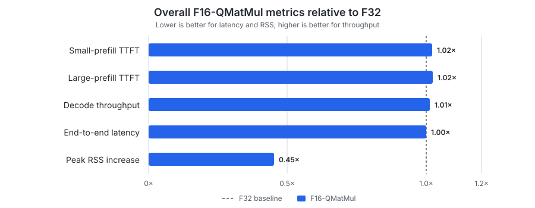
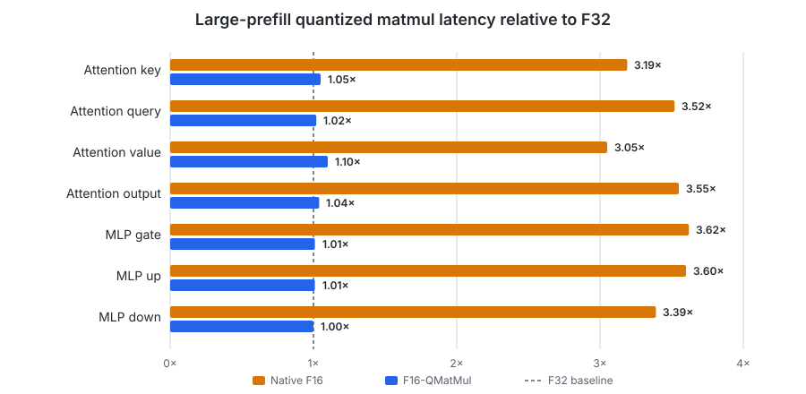
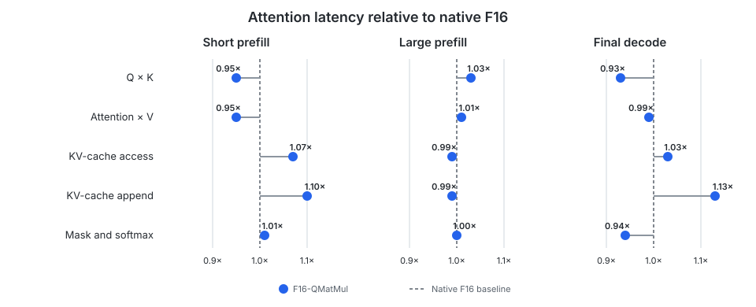

# CPU Activation Dtype

Local inference is often constrained by memory capacity and bandwidth. Using
F16 instead of F32 for activations and the KV cache halves their element size,
which allows longer contexts or more concurrent requests within the same
memory budget. F16 can also reduce the cost of bandwidth-bound computations
and may make matmul faster when the backend has an optimized F16 kernel.

We added configurable F32 and F16 activation types, then benchmarked CPU
inference to determine whether F16 provides those benefits in practice. The
initial results revealed a substantial performance regression, which we
investigated with operation-level tracing and addressed with a targeted
workaround.

**Scope:**

- The goal is not to implement a new quantized CPU kernel. We want a simple path
  that preserves most of F16's memory savings while keeping performance close to
  the existing F32 implementation.
- We also keep the attention implementation fixed at contiguous attention,
  grouped Q, and upfront full V. Finding the best implementation is out of scope
  here and belongs in a separate
  [CPU paged-attention benchmark](cpu_paged_attention.md).

**Reproducibility:**

- Hardware: Apple M2 with an 8-core CPU, 10-core GPU, and 16 GB of unified
  memory.
- Operating system: macOS 26.6.2.
- Model: Qwen2.5 0.5B Instruct Q4_K_M, using a paged KV cache with 16 tokens per
  page.
- Revisions:
  [`mini-vllm-rs` `830ce6e`](https://github.com/lun0522/mini-vllm-rs/commit/830ce6e872cf10bc46f138371065c15b7a4d89a5)
  and
  [`mini-vllm-eval` `c8f85a2`](https://github.com/lun0522/mini-vllm-eval/commit/c8f85a2b32d75903df54994ed47f771ddb8fc782).
- Attention implementation: contiguous attention, grouped Q, and upfront full
  V.
- `CANDLE_NUM_THREADS` and `RAYON_NUM_THREADS` were unset.
- Each server handled a 1-token warm-up, a 121-input-token request generating
  1 token, and a 1068-input-token request generating 1024 tokens. The maximum
  batched token count was 1024.
- Overall latency, throughput, and RSS are the mean and sample standard
  deviation from 5 runs without tracing.
- Operation-level timings come from 1 representative run with tracing enabled.

## Initial F16 Implementation

The first implementation uses F16 for runtime activations, dequantized token
embeddings and normalization weights, model constants, and the KV cache. Model
weights remain in their original GGUF quantized format.

The benchmark gives F32 and F16 the same KV-cache token capacity, allocating
128 MiB for F32 and 64 MiB for F16. During the long request, native F16 reduced
the peak RSS increase from **268.28 MiB** to **107.79 MiB**, a **59.8%**
reduction.

### Overall Performance Regressed

Native F16 was substantially slower in every overall performance metric:

| Metric | F32 | Native F16 |
|---|---:|---:|
| Small-prefill TTFT | 1595.77 ± 15.52 ms | 5548.18 ± 46.32 ms |
| Large-prefill TTFT | 15423.44 ± 153.73 ms | 50552.54 ± 415.10 ms |
| Decode throughput | 34.32 ± 0.26 tok/s | 16.37 ± 0.07 tok/s |
| End-to-end latency | 45.234 ± 0.378 s | 113.046 ± 0.626 s |
| Peak RSS increase | 268.28 ± 2.70 MiB | 107.79 ± 0.92 MiB |

Starting and absolute peak RSS varied substantially between processes, while
the peak increase during the measured long request was stable. We therefore use
the peak RSS increase for the memory comparison.

### Attention Improved as Expected

The representative trace shows that the large-prefill query-key and
attention-value matmuls benefit from F16. These operations multiply
unquantized tensors, so both operands use the activation dtype. KV-cache access
and append operations are also faster with the smaller tensors.

| Large-prefill attention span | F32 | Native F16 |
|---|---:|---:|
| Q × K | 177.57 ms | 85.07 ms |
| Attention × V | 194.40 ms | 103.35 ms |
| KV-cache access | 1.793 ms | 1.286 ms |
| KV-cache append | 4.713 ms | 3.209 ms |
| Mask and softmax | 1147.02 ms | 1392.12 ms |

Mask and softmax is the exception. Candle's CPU softmax uses a generic element
loop. For F16, `half::f16::exp()` converts each value to F32 for the exponential
and then back to F16. That conversion-heavy path is the likely cause of the
**21.4%** regression.

We chose to accept the remaining F16 softmax cost, as its excess over F32 is
about 1.6% of F16-QMatMul large-prefill latency and 0.74 ms (2.6%) of a final
decode step.

### Quantized Matmul Was the Bottleneck

The faster attention matmuls were too small to offset the regression. The
traced `qmatmul` spans cover multiplication of activations by quantized model
weights. The same large-prefill operations were three to four times slower
with F16 inputs:

| Large-prefill `qmatmul` operation | F32 | Native F16 |
|---|---:|---:|
| Attention key | 153.53 ms | 489.83 ms |
| Attention query | 931.23 ms | 3282.11 ms |
| Attention value | 98.23 ms | 300.15 ms |
| Attention output | 924.97 ms | 3283.27 ms |
| MLP gate | 4892.27 ms | 17714.60 ms |
| MLP up | 4920.87 ms | 17723.80 ms |
| MLP down | 981.71 ms | 3326.83 ms |

The large MLP projections dominate the forward pass, overwhelming the faster
Q × K and Attention × V operations.

## Why Native F16 Quantized Matmul Is Slow

We checked Candle 0.11.0's source code, specifically `quantized/mod.rs` and
`quantized/k_quants.rs`, and found that its CPU quantized-matmul dispatcher
treats F32 and F16 inputs differently. In simplified form, the F32 branch
attempts the specialized AArch64 Q4_K × Q8 kernel before falling back to the
generic implementation, while the F16 branch goes directly to
`matmul_t_f16`:

```rust
match input.dtype() {
    DType::F32 if weights_are_q4k && n.is_multiple_of(8) => {
        matmul_q4k_x8(/* ... */)
    }
    DType::F32 => weights.matmul_t(/* ... */),
    DType::F16 => weights.matmul_t_f16(/* ... */),
}
```

The F16 branch therefore misses the optimized eight-column kernel, see the
[implementation details](#candle-f16-quantized-matmul-implementation).
Implementing an equivalent optimized Q4 × F16 kernel in this project would be
a much larger change.

## F16 Quantized Matmul via F32

Our workaround converts only the input activation from F16 to F32, invokes
Candle's existing quantized matmul, and converts the output back to F16. The
weights remain in the quantized format.

The conversions become negligible for larger matmuls: multiplication is
`O(m × n × k)`, while converting the input is `O(m × k)` and the output is
`O(m × n)`.

### Overall Performance Recovered

The resulting overall metrics for F16-QMatMul relative to F32 are:



F16-QMatMul's peak RSS increase is 13.70 MiB higher than native F16, likely
because the workaround temporarily holds full F32 input and output tensors for
each quantized matmul, while Candle's native F16 path allocates only temporary
F32 vectors for individual activation rows. We accept this small temporary
increase in exchange for the persistent memory savings from F16 activations and
the KV cache.

### Quantized Matmul Recovered

The representative trace confirms that the workaround fixes the original
bottleneck in large-prefill `qmatmul` spans with the same operation labels:



- Native F16 is roughly 3–4× slower than F32.
- F16-QMatMul is within 0–10% of F32.

### F16 Attention Was Preserved

The workaround applies only to quantized matmul. Attention continues to operate
directly on F16 activations:



- Q × K and Attention × V remain effectively unchanged from native F16.
- Cache, mask, and softmax operations show no material regression from native
  F16.

Exact timings and the small differences are listed in the
[attention timings appendix](#attention-timings).

## Conclusions

1. Native F16 cuts the measured peak RSS increase by **59.8%** and accelerates
   unquantized attention, but Candle's F16 quantized matmul makes inference
   substantially slower overall.
2. Routing F16 quantized matmul through Candle's optimized F32 path restores
   approximately F32 performance without materializing a dequantized copy of
   the model weights.
3. The workaround retains a **54.7%** lower peak RSS increase than F32. A custom
   Q4 × F16 kernel is not justified by the remaining performance difference.

## Appendix

### Candle F16 Quantized-Matmul Implementation

The specialized F32 path repacks Q4_K weights in eight-column groups, converts
each F32 activation row to Q8_K once, and evaluates eight output columns at a
time with an AArch64 dot-product kernel. The generic F16 implementation instead
converts an activation row element-by-element to a temporary F32 vector,
quantizes it, then loops over output columns and calls the single-column
`vec_dot` implementation:

```rust
let lhs_f32 = lhs_f16.iter().map(|x| x.to_f32()).collect();
VecDotType::from_float(&lhs_f32, lhs_quantized);
for output_column in output_columns {
    output_column = f16::from_f32(vec_dot(/* ... */));
}
```

### Overall Results

| Metric | F32 | Native F16 | F16-QMatMul |
|---|---:|---:|---:|
| Small-prefill TTFT | 1595.77 ± 15.52 ms | 5548.18 ± 46.32 ms | 1632.16 ± 57.65 ms |
| Large-prefill TTFT | 15423.44 ± 153.73 ms | 50552.54 ± 415.10 ms | 15798.24 ± 220.32 ms |
| Decode throughput | 34.32 ± 0.26 tok/s | 16.37 ± 0.07 tok/s | 34.75 ± 0.11 tok/s |
| End-to-end latency | 45.234 ± 0.378 s | 113.046 ± 0.626 s | 45.236 ± 0.290 s |
| Peak RSS increase | 268.28 ± 2.70 MiB | 107.79 ± 0.92 MiB | 121.49 ± 1.74 MiB |

- One 1732.02 ms F16-QMatMul small-prefill outlier increased both the mean and
  standard deviation. The other 4 measurements were between 1597.48 and
  1631.98 ms.

### Large-Prefill Quantized Matmul Timings

| `qmatmul` operation | F32 | Native F16 | F16-QMatMul | F16-QMatMul / F32 |
|---|---:|---:|---:|---:|
| Attention key | 153.53 ms | 489.83 ms | 160.75 ms | 1.05× |
| Attention query | 931.23 ms | 3282.11 ms | 952.61 ms | 1.02× |
| Attention value | 98.23 ms | 300.15 ms | 108.04 ms | 1.10× |
| Attention output | 924.97 ms | 3283.27 ms | 963.02 ms | 1.04× |
| MLP gate | 4892.27 ms | 17714.60 ms | 4957.78 ms | 1.01× |
| MLP up | 4920.87 ms | 17723.80 ms | 4960.48 ms | 1.01× |
| MLP down | 981.71 ms | 3326.83 ms | 985.71 ms | 1.00× |

- The optimized spans are generally within a few percent of F32.
- Smaller operations have more relative conversion overhead, but their absolute
  contribution is small.

### Attention Timings

#### Short Prefill

| Attention span | F32 | Native F16 | F16-QMatMul | F16-QMatMul / Native F16 |
|---|---:|---:|---:|---:|
| Q × K | 6.681 ms | 5.403 ms | 5.158 ms | 0.95× |
| Attention × V | 6.548 ms | 5.362 ms | 5.113 ms | 0.95× |
| KV-cache access | 0.338 ms | 0.230 ms | 0.247 ms | 1.07× |
| KV-cache append | 0.730 ms | 0.443 ms | 0.488 ms | 1.10× |
| Mask and softmax | 18.431 ms | 22.222 ms | 22.451 ms | 1.01× |

#### Large Prefill

| Attention span | F32 | Native F16 | F16-QMatMul | F16-QMatMul / Native F16 |
|---|---:|---:|---:|---:|
| Q × K | 177.573 ms | 85.073 ms | 87.395 ms | 1.03× |
| Attention × V | 194.404 ms | 103.352 ms | 104.861 ms | 1.01× |
| KV-cache access | 1.793 ms | 1.286 ms | 1.274 ms | 0.99× |
| KV-cache append | 4.713 ms | 3.209 ms | 3.189 ms | 0.99× |
| Mask and softmax | 1147.020 ms | 1392.120 ms | 1398.950 ms | 1.00× |

#### Final Decode

| Attention span | F32 | Native F16 | F16-QMatMul | F16-QMatMul / Native F16 |
|---|---:|---:|---:|---:|
| Q × K | 4.308 ms | 4.122 ms | 3.840 ms | 0.93× |
| Attention × V | 1.572 ms | 1.373 ms | 1.359 ms | 0.99× |
| KV-cache access | 4.140 ms | 2.898 ms | 2.997 ms | 1.03× |
| KV-cache append | 0.045 ms | 0.032 ms | 0.036 ms | 1.13× |
| Mask and softmax | 3.713 ms | 4.759 ms | 4.452 ms | 0.94× |

- Compared with native F16, F16-QMatMul makes short-prefill and final-decode
  KV-cache append 10% and 13% slower, but the increases are only 0.045 ms and
  0.004 ms.
- The F16-QMatMul large-prefill mask-and-softmax span is 6.83 ms slower than
  native F16, less than 0.1% of the complete large-prefill forward.
- Overall, the attention spans show no material regression from native F16 to
  F16-QMatMul.
