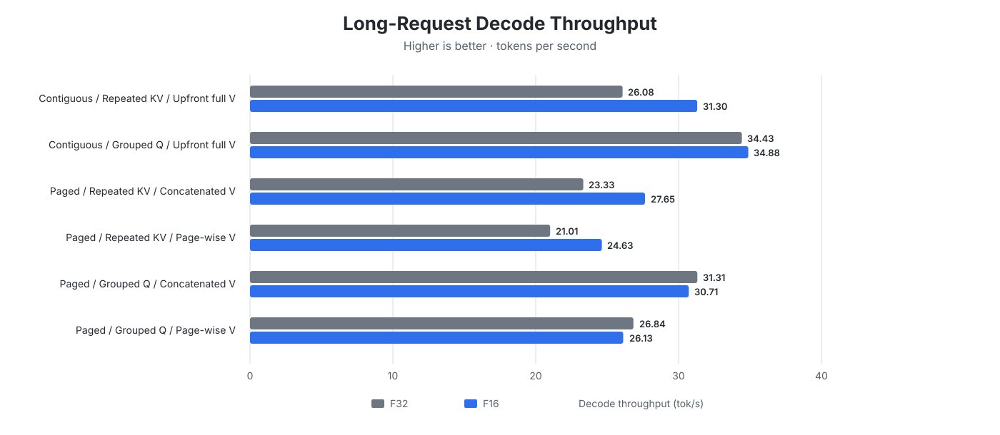
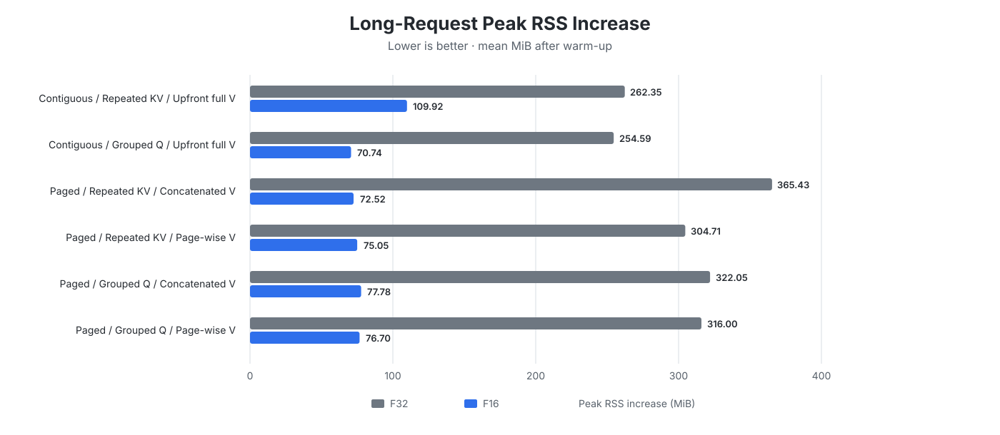

# CPU Paged Attention with F16 Activations

The [CPU activation-dtype benchmark](cpu_activation_dtype.md) fixes attention
at contiguous attention, grouped Q, and upfront full V so it can isolate the
effect of F16 activations. This benchmark instead fixes the activation dtype at
F16 and finds the best CPU attention implementation.

The earlier
[F32 CPU paged-attention benchmark](cpu_paged_attention_f32.md) evaluated the
same implementation choices with F32 activations. F16 halves the size of
attention tensors and the KV cache, and its unquantized attention matmuls have
different performance characteristics, so the best F32 configuration is not
assumed to remain optimal.

**Scope:**

- Use F16 activations and KV caches with F16 quantized matmul routed through
  Candle's optimized F32 path.
- Compare contiguous and paged attention, repeated KV and grouped Q, and the
  available V-matmul strategies.
- Select the best default from the existing implementations. New fused or
  architecture-specific attention kernels are out of scope.

## Reproducibility

| Item | Details |
|---|---|
| Hardware | Apple M2 with an 8-core CPU, 10-core GPU, and 16 GB of unified memory |
| Operating system | macOS 26.6.2 |
| Model | Qwen2.5 0.5B Instruct Q4_K_M, using a paged KV cache with 16 tokens per page |
| Revisions | [`mini-vllm-rs` `da629ce`](https://github.com/lun0522/mini-vllm-rs/commit/da629cebece16797d44cdc35aa691869816244c7) and [`mini-vllm-eval` `4a5b7e8`](https://github.com/lun0522/mini-vllm-eval/commit/4a5b7e8856f040cd8e00f46f9e85de4dc5cf84b8) |
| Procedure | Follow the `cpu-paged-attention-benchmark` skill in the `mini-vllm-eval` repository |
| Configuration | The six attention implementations below, a maximum batched token count of 1024, and F16 quantized matmul routed through Candle's optimized F32 path |
| Workload | A 1-token warm-up; a 121-input-token request generating 1 token; and a 1068-input-token request generating 1024 tokens |
| Measurements | Each F32 and F16 configuration was measured 5 times without tracing; results report the mean and sample standard deviation |
| Thread settings | `CANDLE_NUM_THREADS` and `RAYON_NUM_THREADS` unset |

## Implementations

The benchmark compares the same six valid combinations as the original CPU
paged-attention benchmark:

| Attention | Q/KV layout | V matmul |
|---|---|---|
| Contiguous | Repeated KV | Upfront full V |
| Contiguous | Grouped Q | Upfront full V |
| Paged | Repeated KV | Concatenated V |
| Paged | Repeated KV | Page-wise V |
| Paged | Grouped Q | Concatenated V |
| Paged | Grouped Q | Page-wise V |

These choices isolate three decisions:

1. **Contiguous vs. paged attention:** Every configuration stores K and V in a
   paged KV cache. Contiguous attention reconstructs full K and V tensors
   before attention, while paged attention computes query-key scores directly
   from one cache page at a time.
2. **Repeated KV vs. grouped Q:** Repeated KV copies K and V heads to match the
   query-head count. Grouped Q reshapes queries so each group shares the
   original KV head without copying it.
3. **Upfront full V vs. concatenated V vs. page-wise V:**
   - **Upfront full V** reconstructs full K and full V before contiguous
     attention starts. It is called "upfront" because V is materialized before
     the query-key calculation, even though it is not consumed until after
     softmax.
   - **Concatenated V** reconstructs the same full V tensor only after the paged
     query-key calculation and softmax. K remains page-wise.
   - **Page-wise V** never reconstructs full V. It multiplies each attention-
     weight slice by its corresponding V page and accumulates the outputs.

## Results

The charts show mean long-request decode and memory measurements, where the
attention implementation matters most. Exact measurements, including prefill
latency and sample standard deviations, are available in the
[appendix](#appendix-detailed-results).

### Decode Throughput

### Peak RSS Increase

Peak increase is measured during the long request relative to RSS after the
warm-up and small-prefill requests.

## Analysis

- **F16 delivers the main benefit: much lower memory use.** Peak RSS growth is
  **58–80%** lower than F32 across all six implementations. Process-level
  variance makes the smaller differences among the F16 cases unsuitable for
  ranking them by memory.
- **F16 makes repeated KV cheaper, but grouped Q still wins.** Repeated-KV
  decode improves **17.2–20.0%** over F32 because its expanded KV tensors are
  smaller. This narrows the grouped-Q advantage over repeated KV from **32–34%**
  with F32 to only **11%** with F16. Contiguous attention with grouped Q remains
  the fastest at **34.88 tok/s**.
- **Grouped-Q F16 reaches the intended F32 parity.** Its decode results range
  from **2.7% slower to 1.3% faster** than F32, and every implementation's
  long-prefill TTFT is within **2.8%**. Quantized projections still use the
  optimized F32 matmul plus conversion, so only KV-cache operations and
  self-attention become faster.
- **Paging and page-wise V remain slower.** Under F16, paged attention with
  concatenated V is about **12%** slower than its matching contiguous path.
  Page-wise V then loses another **10.9%** with repeated KV or **14.9%** with
  grouped Q, without a measurable memory advantage among the F16 paged cases.

The operation-level explanation is covered by the
[CPU activation-dtype benchmark](cpu_activation_dtype.md): F16 accelerates
Q × K and Attention × V, while routing quantized projections through F32
recovers their performance without dequantizing the model weights.

## Decision

- Default to use F16 activations with contiguous attention, grouped Q, and
  upfront full V on CPU. This combination retains F16's memory savings, reaches
  F32 overall performance, and remains the fastest attention implementation.
- If paged attention is required, grouped Q with concatenated V is the preferred
  paged alternative.

## Appendix: Detailed Results

### Small Prefill

| Configuration | F32 TTFT (ms) | F16 TTFT (ms) | F16/F32 |
|---|---:|---:|---:|
| Contiguous / Repeated KV / Upfront full V | 1596.880 ± 14.140 | 1622.642 ± 5.355 | 1.016× |
| Contiguous / Grouped Q / Upfront full V | 1577.136 ± 4.098 | 1629.536 ± 65.782 | 1.033× |
| Paged / Repeated KV / Concatenated V | 1593.738 ± 7.256 | 1618.270 ± 6.163 | 1.015× |
| Paged / Repeated KV / Page-wise V | 1590.580 ± 9.020 | 1620.846 ± 27.626 | 1.019× |
| Paged / Grouped Q / Concatenated V | 1584.424 ± 4.179 | 1610.228 ± 3.574 | 1.016× |
| Paged / Grouped Q / Page-wise V | 1700.112 ± 194.104 | 1663.066 ± 59.365 | 0.978× |

### Long Request

| Configuration | F32 TTFT (ms) | F16 TTFT (ms) | F16/F32 | F32 E2E (s) | F16 E2E (s) | F16/F32 | F32 decode (tok/s) | F16 decode (tok/s) | F16/F32 |
|---|---:|---:|---:|---:|---:|---:|---:|---:|---:|
| Contiguous / Repeated KV / Upfront full V | 15612.840 ± 273.126 | 15817.540 ± 59.750 | 1.013× | 54.841 ± 0.479 | 48.497 ± 0.260 | 0.884× | 26.078 ± 0.220 | 31.304 ± 0.239 | 1.200× |
| Contiguous / Grouped Q / Upfront full V | 15375.480 ± 96.875 | 15813.020 ± 114.870 | 1.028× | 45.090 ± 0.298 | 45.145 ± 0.164 | 1.001× | 34.428 ± 0.236 | 34.878 ± 0.143 | 1.013× |
| Paged / Repeated KV / Concatenated V | 16311.260 ± 111.217 | 16539.120 ± 32.957 | 1.014× | 60.165 ± 0.411 | 53.540 ± 0.184 | 0.890× | 23.328 ± 0.170 | 27.648 ± 0.132 | 1.185× |
| Paged / Repeated KV / Page-wise V | 17820.680 ± 52.770 | 17733.540 ± 72.512 | 0.995× | 66.512 ± 0.157 | 59.268 ± 0.208 | 0.891× | 21.012 ± 0.062 | 24.630 ± 0.111 | 1.172× |
| Paged / Grouped Q / Concatenated V | 15793.840 ± 58.915 | 16071.500 ± 32.239 | 1.018× | 48.464 ± 0.135 | 49.381 ± 0.152 | 1.019× | 31.314 ± 0.133 | 30.714 ± 0.141 | 0.981× |
| Paged / Grouped Q / Page-wise V | 16846.020 ± 426.761 | 16702.020 ± 87.313 | 0.991× | 54.966 ± 0.466 | 55.859 ± 0.308 | 1.016× | 26.838 ± 0.075 | 26.126 ± 0.202 | 0.973× |

### Long-Request Peak RSS Increase

| Configuration | F32 (MiB) | F16 (MiB) | F16/F32 |
|---|---:|---:|---:|
| Contiguous / Repeated KV / Upfront full V | 262.352 ± 26.806 | 109.916 ± 36.242 | 0.419× |
| Contiguous / Grouped Q / Upfront full V | 254.588 ± 3.980 | 70.736 ± 21.758 | 0.278× |
| Paged / Repeated KV / Concatenated V | 365.434 ± 39.503 | 72.522 ± 7.050 | 0.198× |
| Paged / Repeated KV / Page-wise V | 304.712 ± 3.527 | 75.054 ± 13.613 | 0.246× |
| Paged / Grouped Q / Concatenated V | 322.048 ± 16.053 | 77.782 ± 21.341 | 0.242× |
| Paged / Grouped Q / Page-wise V | 316.002 ± 5.360 | 76.698 ± 5.236 | 0.243× |

### Per-Implementation Interpretation

| Implementation | F16 result | Interpretation |
|---|---|---|
| **Contiguous / Repeated KV / Upfront full V** | **31.30 tok/s**, **109.92 MiB** peak increase | F16 makes repeated KV 20.0% faster than F32, but copying expanded K and V still leaves it 10.2% behind contiguous grouped Q. |
| **Contiguous / Grouped Q / Upfront full V** | **34.88 tok/s**, **70.74 MiB** peak increase | Avoids KV expansion and retains large attention matmuls. It is the fastest F16 implementation and performs 1.3% above its F32 result. |
| **Paged / Repeated KV / Concatenated V** | **27.65 tok/s**, **72.52 MiB** peak increase | F16 improves throughput by 18.5% over F32, but page-wise query-key work makes it 11.7% slower than contiguous repeated KV. |
| **Paged / Repeated KV / Page-wise V** | **24.63 tok/s**, **75.05 MiB** peak increase | F16 improves throughput by 17.2% over F32, but many small V matmuls make it 10.9% slower than concatenated V. |
| **Paged / Grouped Q / Concatenated V** | **30.71 tok/s**, **77.78 MiB** peak increase | This is the fastest paged implementation, although paging leaves it 11.9% behind contiguous grouped Q. It is 1.9% slower than its F32 result. |
| **Paged / Grouped Q / Page-wise V** | **26.13 tok/s**, **76.70 MiB** peak increase | Page-wise V provides no clear memory benefit and reduces throughput by 14.9% relative to grouped Q with concatenated V. |
