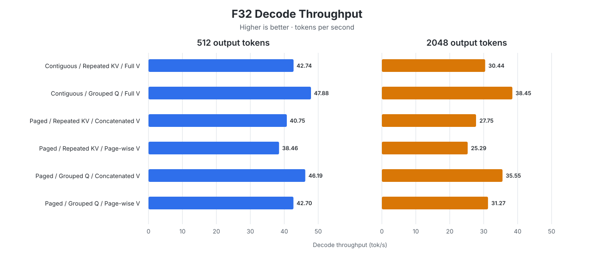
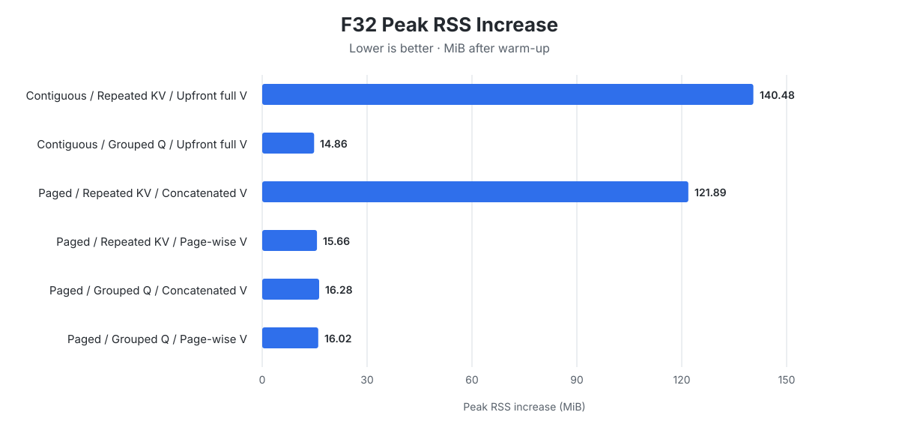

# CPU Paged Attention with F32 Activations

We added a simple CPU paged-attention implementation and tested a few ways to
reduce its memory use and execution time. The benchmark uses the Qwen2.5 0.5B
model and a paged KV cache with 16 tokens per page. Each server handles three
sequential requests that generate 1, 512, and 2048 output tokens.

This benchmark covers F32 activations only. We added F16 activation support
later and evaluated the same attention choices separately in the
[F16 CPU paged-attention benchmark](cpu_paged_attention_f16.md). That later
benchmark provides more reliable aggregate results because it measured each
configuration five times. It also reproduced this single-run experiment's main
result: contiguous attention with grouped Q was the best overall
implementation.

**Scope:**

CPU inference is not the main target of this project. We therefore focus on
simple optimizations rather than trying to build an optimal CPU paged-attention
kernel. The conclusions in this report apply specifically to F32 activations.

## Reproducibility

| Item | Details |
|---|---|
| Hardware | Apple M2 with an 8-core CPU, 10-core GPU, and 16 GB of unified memory |
| Operating system | macOS 26.6.2 |
| Model | Qwen2.5 0.5B Instruct Q4_K_M, using a paged KV cache with 16 tokens per page |
| Revisions | [`mini-vllm-rs` `2bc67ec`](https://github.com/lun0522/mini-vllm-rs/commit/2bc67ec7d7043fb2256e7e9eb61b263f864eb05b) and [`mini-vllm-eval` `9b72cb3`](https://github.com/lun0522/mini-vllm-eval/commit/9b72cb3df02f05955a4c288a752cd9d8639c93be) |
| Procedure | Run `python3 main.py --benchmark cpu_paged_attention` from the `mini-vllm-eval` repository |
| Configuration | The six attention implementations below; the harness set only their configuration-specific CPU attention variables |
| Workload | Three sequential requests generating 1, 512, and 2048 output tokens |
| Measurements | Each configuration was measured once |
| Thread settings | `CANDLE_NUM_THREADS` and `RAYON_NUM_THREADS` unset |

## Implementations

Candle 0.11.0 did not provide a CPU paged-attention implementation. Our baseline
uses paged KV-cache management but reconstructs contiguous K and V tensors
before calculating attention. In other words, the cache is paged, while the
attention calculation remains contiguous.

This benchmark compares three choices:

1. **Contiguous vs. paged attention:** Contiguous attention reconstructs full K
   and V before calculating attention. Paged attention calculates query-key
   scores one cache page at a time, then joins the score slices before softmax.
2. **Repeated KV vs. grouped Q:** For GQA, the shape of Q is
   `[1, num_q_heads, q_len, head_dim]`, while K and V have shape
   `[1, num_kv_heads, kv_len, head_dim]`. The baseline path copies each K and V
   head to match the number of query heads. The grouped-Q path instead reshapes
   Q to group query heads that share a KV head:
   `[num_kv_heads, repetition_count * q_len, head_dim]`. This allows each group
   to use its original K and V head without copying them.
3. **Upfront full V vs. concatenated V vs. page-wise V:**
   - **Upfront full V** reconstructs both full K and full V before contiguous
     attention, as in the baseline path.
   - **Concatenated V** produces the same V shape and values, but only after the
     paged query-key calculation and softmax. K remains page-wise.
   - **Page-wise V** never reconstructs full V. It multiplies each attention-
     weight slice by its matching V page, then adds the page outputs.

## Results

The six implementations perform similarly for the 1-token request, so the
charts focus on long-context decode and memory. Exact measurements for every
request are available in the [appendix](#appendix-detailed-results).

### Decode Throughput at 512 and 2048 Output Tokens

### Peak RSS During the 512- and 2048-Token Requests

Peak increase is measured relative to RSS after the 1-token warm-up and covers
both subsequent requests.

## Analysis

Each configuration was measured once, so these values should be treated as
directional. Starting RSS stays within about 4.4 MiB across the six runs,
however, and the large differences align with the tensor layouts:

- **Grouped Q improves both speed and memory.** For contiguous attention, it
  raises 2048-token decode throughput from **30.44** to **38.45 tok/s** and
  reduces peak RSS growth from **140.48** to **14.86 MiB**. The paged cases show
  the same pattern: grouped Q with concatenated V reaches **35.55 tok/s** and
  **16.28 MiB**, compared with **27.75 tok/s** and **121.89 MiB** for repeated
  KV. Avoiding expansion from KV heads to query heads explains both changes.
- **Paged query-key attention adds overhead.** With grouped Q and a full V
  matmul in both cases, paged attention reaches **35.55 tok/s**, versus
  **38.45 tok/s** for contiguous attention, while their peak RSS increases are
  similarly small. Splitting one large query-key matmul into many page-sized
  operations therefore costs speed without providing a meaningful memory win
  in this run.
- **Page-wise V helps only when KV is repeated.** It reduces the paged
  repeated-KV peak increase from **121.89** to **15.66 MiB**, at the cost of
  lowering throughput from **27.75** to **25.29 tok/s**. Once grouped Q already
  avoids the full-head expansion, page-wise V changes the measured peak from
  **16.28** to **16.02 MiB** while reducing throughput from **35.55** to
  **31.27 tok/s**.

Per-implementation details are retained in the
[appendix](#per-implementation-interpretation).

## Decision and Future Work

Contiguous attention with grouped Q became the default because it was both the
fastest and lowest-memory implementation in this experiment. Paged grouped-Q
attention with concatenated V remains the preferred paged alternative, while
page-wise V is worthwhile only when repeated KV cannot be avoided.

If this project were to evolve into a production-grade CPU inference
framework, the next step should be a fused attention kernel using online
softmax, similar to FlashAttention. That would avoid building the full score
tensor and the full V tensor. This is currently out of scope.

## Appendix: Detailed Results

### Output Token Count: 1

| Attention | Q/KV layout | V matmul | TTFT (ms) | E2E (s) | E2E vs baseline | Total (tok/s) |
|---|---|---|---:|---:|---:|---:|
| Contiguous | Repeated KV | Upfront full V | 1721.12 | 1.721 | 1.00x | 0.58 |
| Contiguous | Grouped Q | Upfront full V | 1689.37 | 1.689 | 1.02x | 0.59 |
| Paged | Repeated KV | Concatenated V | 1728.34 | 1.728 | 1.00x | 0.58 |
| Paged | Repeated KV | Page-wise V | 1762.07 | 1.762 | 0.98x | 0.57 |
| Paged | Grouped Q | Concatenated V | 1698.52 | 1.699 | 1.01x | 0.59 |
| Paged | Grouped Q | Page-wise V | 1713.40 | 1.713 | 1.00x | 0.58 |

### Output Token Count: 512

| Attention | Q/KV layout | V matmul | TTFT (ms) | E2E (s) | E2E vs baseline | Total (tok/s) | Decode (tok/s) | Decode vs baseline |
|---|---|---|---:|---:|---:|---:|---:|---:|
| Contiguous | Repeated KV | Upfront full V | 1708.33 | 13.663 | 1.00x | 37.47 | 42.74 | 1.00x |
| Contiguous | Grouped Q | Upfront full V | 1682.23 | 12.355 | 1.11x | 41.44 | 47.88 | 1.12x |
| Paged | Repeated KV | Concatenated V | 1703.08 | 14.243 | 0.96x | 35.95 | 40.75 | 0.95x |
| Paged | Repeated KV | Page-wise V | 1716.93 | 15.003 | 0.91x | 34.13 | 38.46 | 0.90x |
| Paged | Grouped Q | Concatenated V | 1699.60 | 12.762 | 1.07x | 40.12 | 46.19 | 1.08x |
| Paged | Grouped Q | Page-wise V | 1710.05 | 13.677 | 1.00x | 37.44 | 42.70 | 1.00x |

### Output Token Count: 2048

| Attention | Q/KV layout | V matmul | TTFT (ms) | E2E (s) | E2E vs baseline | Total (tok/s) | Decode (tok/s) | Decode vs baseline |
|---|---|---|---:|---:|---:|---:|---:|---:|
| Contiguous | Repeated KV | Upfront full V | 1709.63 | 68.953 | 1.00x | 29.70 | 30.44 | 1.00x |
| Contiguous | Grouped Q | Upfront full V | 1704.98 | 54.946 | 1.25x | 37.27 | 38.45 | 1.26x |
| Paged | Repeated KV | Concatenated V | 1710.67 | 75.488 | 0.91x | 27.13 | 27.75 | 0.91x |
| Paged | Repeated KV | Page-wise V | 1720.17 | 82.647 | 0.83x | 24.78 | 25.29 | 0.83x |
| Paged | Grouped Q | Concatenated V | 1695.58 | 59.284 | 1.16x | 34.55 | 35.55 | 1.17x |
| Paged | Grouped Q | Page-wise V | 1772.48 | 67.234 | 1.03x | 30.46 | 31.27 | 1.03x |

### Peak RSS During the 512- and 2048-Token Requests

| Attention | Q/KV layout | V matmul | Start RSS (MiB) | Peak RSS (MiB) | Peak increase (MiB) |
|---|---|---|---:|---:|---:|
| Contiguous | Repeated KV | Upfront full V | 1365.56 | 1506.05 | 140.48 |
| Contiguous | Grouped Q | Upfront full V | 1363.23 | 1378.09 | 14.86 |
| Paged | Repeated KV | Concatenated V | 1367.59 | 1489.48 | 121.89 |
| Paged | Repeated KV | Page-wise V | 1366.23 | 1381.89 | 15.66 |
| Paged | Grouped Q | Concatenated V | 1364.81 | 1381.09 | 16.28 |
| Paged | Grouped Q | Page-wise V | 1367.17 | 1383.19 | 16.02 |

### Per-Implementation Interpretation

| Implementation | Memory behavior | Execution behavior |
|---|---|---|
| **Contiguous attention + repeated KV + upfront full V** (baseline) | Repeats full-length K and V across all query heads, producing the largest **140.48 MiB** increase. | Uses large matmuls, but copying full K and V becomes expensive as the cache grows. Decode falls to **30.44 tok/s** at 2048 tokens. |
| **Contiguous attention + grouped Q + upfront full V** | Keeps full-length K and V at the smaller KV-head count, producing the lowest **14.86 MiB** increase. | Avoids KV copies and keeps large, efficient matmuls. It was the fastest case at **38.45 tok/s**. |
| **Paged attention + repeated KV + concatenated V** | Repeats K one small page at a time, but still concatenates and repeats full-length V. Peak increase remains high at **121.89 MiB**. | Replaces the large query-key matmul with many small per-page matmuls and still copies full V, so it was slower than the contiguous baseline at **27.75 tok/s**. |
| **Paged attention + repeated KV + page-wise V** | Repeats only one K or V page at a time, keeping the peak increase low at **15.66 MiB**. | Replaces one large score-value matmul with many small ones and adds their results. It was the slowest case at **25.29 tok/s**. |
| **Paged attention + grouped Q + concatenated V** | Avoids repeating K and V. Concatenated V contains only the original KV heads, so peak increase stays low at **16.28 MiB**. | Keeps one large score-value matmul and was the fastest paged case at **35.55 tok/s**, though page operations still made it slower than contiguous grouped Q. |
| **Paged attention + grouped Q + page-wise V** | Avoids repetition and handles V one page at a time, producing a similar **16.02 MiB** increase. | Page-wise score-value matmuls add overhead without saving meaningful memory in this run, reducing decode to **31.27 tok/s**. |

### Cross-Context Behavior

The context-length trends reinforce the implementation-level explanation:

- Grouped Q's advantage grows with the cache. For contiguous attention, its
  decode advantage over repeated KV rises from **12%** at 512 tokens to
  **26%** at 2048 tokens. With paged attention and concatenated V, it rises
  from **13%** to **28%**.
- The cost of page-wise V also grows with the number of pages. Relative to
  concatenated V, its decode penalty rises from **6%** to **9%** with repeated
  KV and from **8%** to **12%** with grouped Q.
- TTFT remains between **1682 and 1772 ms** across the 512- and 2048-token
  cases. The attention choices therefore matter primarily during long-context
  decode, although the single-run measurements do not support interpreting
  small TTFT differences.
