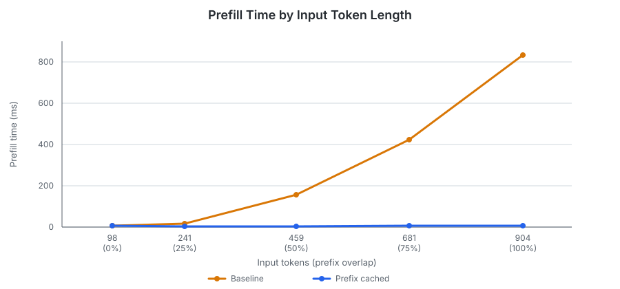
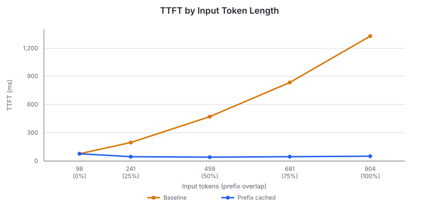
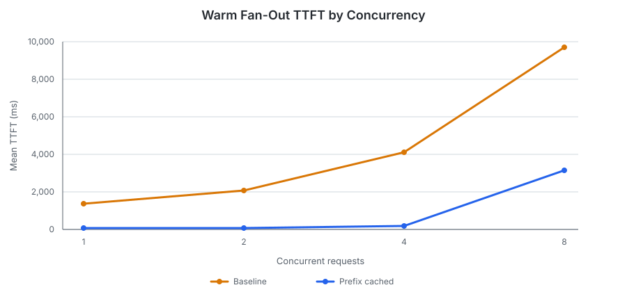
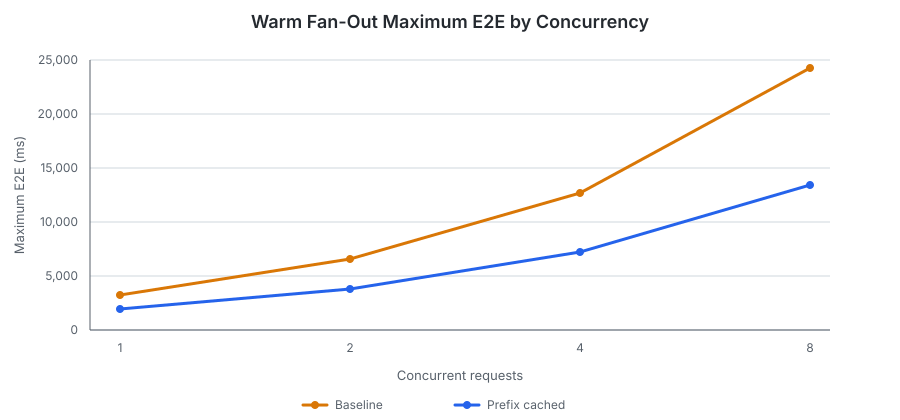
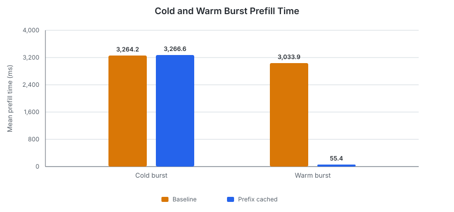
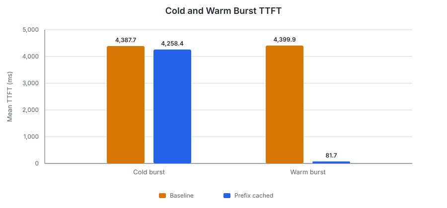
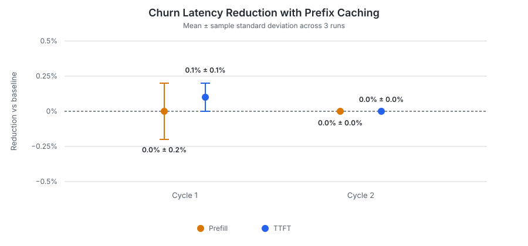

# Prefix-Cache Reuse

Prefix caching keeps completed KV-cache pages indexed by their token prefix so
later requests can attach matching pages instead of recomputing the same
prompt. The expected benefit is lower prefill time and time to first token
(TTFT). It does not eliminate decode work, and scheduling or continuous
batching can still change observed decode and end-to-end latency.

This benchmark compares the paged prefix cache with the ordinary paged cache
across four behaviors: increasing prefix overlap, concurrent reuse of one warm
prefix, simultaneous cold requests followed by a warm retry, and a working set
larger than the cache.

**Scope:**

- Prefixes become reusable when a request finishes. Incremental publication
  and single-flight filling of an in-progress prefix are out of scope.
- This benchmark measures reuse within one inference backend. Cache-aware
  request routing across backends is out of scope.
- The small model and single-machine configuration are intended to demonstrate
  cache behavior, not production throughput or broad hardware scalability.

## Reproducibility

| Item | Details |
|---|---|
| Hardware | Apple M2 with an 8-core CPU, 10-core GPU, and 16 GB of unified memory |
| Operating system | macOS 27.0.1 |
| Model | Qwen2.5 0.5B Instruct Q4_K_M, without a draft model |
| Revisions | [`mini-vllm-rs` `b164c55`](https://github.com/lun0522/mini-vllm-rs/commit/b164c5597cf8e9d9b0d1510159438c9e8a5441ab) and [`mini-vllm-eval` `e9c9e70`](https://github.com/lun0522/mini-vllm-eval/commit/e9c9e7046c0ef9ba561997698d4184cd46223408) |
| Procedure | Follow the `prefix-cache-reuse-benchmark` skill in the `mini-vllm-eval` repository and run `prefix_cache_reuse` |
| Configuration | GPU inference with F32 activations; ordinary paged caching or paged prefix caching; 16 tokens per page; a 128 MiB KV-cache budget; a maximum batched token count of 2,048; a maximum of 8 active requests; default FCFS scheduling |
| Workloads | A prefix-overlap sweep, warm fan-out at concurrency 1/2/4/8, identical cold and warm 4-request bursts, and two cycles over 8 distinct long prefixes; EOS was ignored |
| Measurements | 3 sequential untraced runs reporting the mean and sample standard deviation; the maximum coefficient of variation among headline measurements was 4.64%, so the workflow did not require 2 additional runs |
| Environment overrides | No `MINI_VLLM_*` overrides; `CANDLE_NUM_THREADS` and `RAYON_NUM_THREADS` unset |

## Workloads

The prompts consist of deterministic paragraphs with separate namespaces for
each workload. This prevents an earlier workload from accidentally warming a
later one. Working-set churn runs last because it deliberately fills and
evicts the cache.

For example, an "overlap" probe uses text of this form, repeating the paragraph
with increasing indices before appending the question:

```text
overlap paragraph 0: A distributed inference engine schedules requests, allocates cache pages, runs model layers, and streams generated tokens to its clients. This paragraph provides deterministic benchmark context.
overlap paragraph 1: A distributed inference engine schedules requests, allocates cache pages, runs model layers, and streams generated tokens to its clients. This paragraph provides deterministic benchmark context.
...
overlap-probe question 1: Summarize the context in one sentence.
```

| Workload | Requests | Input tokens | Output tokens | Purpose |
|---|---:|---|---:|---|
| Prefix overlap | 1 seed, then 5 sequential probes | 98, 241, 459, 681, and 904 for the measured probes | 16 each | Measures how reuse changes as approximately 0%, 25%, 50%, 75%, and 100% of a warm document is shared. |
| Warm fan-out | 1 seed, then sequential groups of 1, 2, 4, and 8 concurrent probes | 927 each | 128 each | Measures concurrent requests attaching the same completed prefix. |
| Cold versus warm burst | 2 sequential groups of 4 concurrent, identical probes | 950 each | 128 each | Exposes finish-time publication and then measures reuse after one cold request has published the prefix. |
| Working-set churn | 8 sequential probes repeated for 2 cycles | 975 each | 16 each | Measures eviction and re-indexing when the 7,808-token page-aligned cache footprint exceeds the 5,456-token capacity. |

The overlap percentage is the fraction of the 24-paragraph seed document
included in a probe, not the fraction of that probe restored from cache. For
example, the 25% probe shares 6 *paragraphs* with the seed, but its *question*
is different. Those paragraphs provide 208 reusable tokens (13 complete pages)
out of the probe's 241 input tokens.

The cache indexes complete 16-token pages. Restored tokens measure page-aligned
reuse from the request input. Newly indexed tokens measure pages added when the
request finishes, can include both input and generated tokens, and exclude
pages that another request has already indexed.

## Results

- **Prefill:** Model-side processing of input tokens that were not restored
  from cache, excluding queueing and request setup.
- **TTFT:** Time from client submission until the first streamed output,
  including queueing, request setup, cache handling, and the first-token step.
- **Maximum E2E:** Maximum individual request completion latency within a
  concurrent group, or the single request's completion latency in the overlap
  sweep.

### Cached Prefill Stayed Flat as Input Length Grew





- The zero-overlap probe restored no tokens and performed the same as ordinary
  paged caching.
- At 25% overlap, the cache restored 208 of 241 input tokens and reduced TTFT by
  **77.0%**.
- At 100% overlap, it restored 880 of 904 input tokens, reduced prefill time by
  **99.2%**, and reduced TTFT by **96.2%**.

The remaining TTFT in the cached cases includes request handling, the short
uncached suffix, and producing and returning the first output token. This fixed
work becomes the floor once most of the prompt is restored.

This sweep also provides end-to-end evidence that the prefix-cache
implementation works: it restored the expected page-aligned prefixes and
avoided the corresponding prefill work as the reusable prefix grew.

### A Warm Prefix Benefited Concurrent Requests



Every fan-out request restored 896 tokens. At concurrency 1 through 4, mean
TTFT fell by **95.6–95.9%**. At concurrency 8, it still fell by **67.4%**, but
the 341-page cache could admit only 5 requests at once: the scheduler
conservatively reserved each request's maximum 66-page demand. The remaining 3
requests waited for admitted requests to finish, increasing mean TTFT to 3.161
seconds even though all 8 found the warm prefix.



Maximum E2E improved by 40.5–44.4%, substantially less than TTFT. These
requests generated 128 tokens, so decode and continuous batching remained a
large part of completion latency even after prompt prefill was mostly removed.

### Simultaneous Cold Requests Still Duplicated Prefill

All 4 cold requests arrived before any identical request had finished. They
therefore restored zero tokens and collectively behaved like the ordinary
paged-cache burst. Prefix caching changed cold-burst TTFT by only **3.0% ±
4.3%**, with high prefill variability and no evidence of a meaningful benefit.

When the cold group completed, one request published 1,072 tokens of cache
pages. The other three requests reported zero newly indexed tokens because the
same prefix was already present by the time they finished, but they had still
performed duplicate prefill work.

The following warm group restored 944 tokens per request, reducing mean prefill
and TTFT by **98.1%**.





- **Cold burst:** Newly indexed 1,072 tokens; cached maximum E2E was 12,969.9 ±
  23.5 ms.
- **Warm burst:** Restored 3,776 tokens; cached maximum E2E was 7,162.7 ± 2.8
  ms, a reduction of only **45.3%** because the 128-token decode remained
  uncached.

This is the main limitation exposed by the benchmark: completed-prefix reuse
works, but in-flight requests do not share partially built cache state.
Incremental publication or single-flight filling should be evaluated in a
separate follow-up benchmark.

### An Over-Capacity Cyclic Working Set Thrashed

Each churn cycle visited 8 distinct 975-token prompts sequentially. Both
cycles restored zero tokens and indexed 7,808 tokens. By the time the second
cycle returned to its first prefix, the later prefixes from the first cycle had
already displaced it; continuing the cycle evicted the remaining earlier
entries before they could be reused.



Neither prefill nor TTFT changed materially in either cycle, confirming that
the over-capacity access pattern prevented useful reuse.

### Whole-Run Cache Telemetry

This telemetry was queried after all four workloads completed, so its counters
cover the entire benchmark run rather than only working-set churn. The values
were identical across all 3 runs:

| Metric | Tokens/count |
|---|---:|
| Token capacity | 5,456 |
| Current indexed tokens | 5,440 |
| Cumulative indexed tokens | 20,944 |
| Cumulative evicted tokens | 15,504 |
| Cumulative restored tokens | 19,392 |
| Prefix lookups | 46 |
| Prefix hits | 23 |
| Hit rate | 50.0% |

Here, a prefix hit means that a request restored at least one cached page. The
50.0% value is therefore a request-level hit rate, not the percentage of input
tokens restored from cache.

This breakdown aligns with the expected hits and misses for each workload:

| Workload | Lookups | Hits |
|---|---:|---:|
| Overlap sweep | 6 | 4 |
| Warm fan-out | 16 | 15 |
| Cold/warm burst | 8 | 4 |
| Working-set churn | 16 | 0 |
| **Total** | **46** | **23** |

## Conclusions and Future Work

1. **Resident prefix reuse substantially reduced prefill and TTFT.** Restoring
   880 of 904 input tokens reduced TTFT by 96.2%, and a completed identical
   prefix reduced warm-burst TTFT by 98.1%.
2. **The benefit remained visible under concurrency, but decode and scheduling
   limited E2E improvement.** Warm fan-out reduced maximum E2E by 40.5–44.4%,
   less than its TTFT reduction because every request still generated 128
   tokens.
3. **Finish-time publication leaves duplicate cold work.** Four simultaneous
   identical misses all performed prefill, even though only one ultimately
   added the shared prefix to the index.
4. **Capacity and request order determine whether reuse survives.** A cyclic
   7,808-token working set over a 5,456-token cache restored nothing on its
   second pass and performed the same prefill work as the baseline.

The next implementation step should address in-flight duplication with
incremental cache publication or single-flight prefix filling, followed by a
benchmark that repeats the cold-burst workload.

Cache-aware orchestration can build on the telemetry plumbing, but the current
aggregate counters do not tell a router which backend holds a particular prefix.
That requires a prefix-locality signal and a separate multi-backend benchmark.

## Appendix: Detailed Results

### Prefix-Overlap Measurements

| Overlap | Input | Restored | Baseline prefill (ms) | Cached prefill (ms) | Baseline TTFT (ms) | Cached TTFT (ms) | TTFT reduction |
|---:|---:|---:|---:|---:|---:|---:|---:|
| 0% | 98 | 0 | 6.8 ± 0.5 | 7.3 ± 0.2 | 79.3 ± 0.1 | 79.1 ± 0.2 | 0.2% ± 0.3% |
| 25% | 241 | 208 | 16.1 ± 2.0 | 4.7 ± 0.9 | 199.4 ± 0.6 | 45.9 ± 0.2 | 77.0% ± 0.1% |
| 50% | 459 | 432 | 158.0 ± 0.4 | 4.9 ± 0.6 | 473.0 ± 0.4 | 41.4 ± 0.8 | 91.3% ± 0.2% |
| 75% | 681 | 656 | 423.5 ± 1.9 | 5.7 ± 0.1 | 835.5 ± 1.0 | 45.1 ± 0.1 | 94.6% ± 0.0% |
| 100% | 904 | 880 | 833.1 ± 2.0 | 7.1 ± 0.0 | 1,328.3 ± 1.5 | 50.2 ± 0.1 | 96.2% ± 0.0% |

### Warm Fan-Out Measurements

| Concurrent requests | Restored per request | Baseline TTFT (ms) | Cached TTFT (ms) | TTFT reduction | Baseline max E2E (ms) | Cached max E2E (ms) | Max E2E reduction |
|---:|---:|---:|---:|---:|---:|---:|---:|
| 1 | 896 | 1,383.9 ± 12.2 | 57.3 ± 0.1 | 95.9% ± 0.0% | 3,282.1 ± 16.6 | 1,954.4 ± 4.6 | 40.5% ± 0.3% |
| 2 | 896 | 2,092.3 ± 1.8 | 90.4 ± 0.1 | 95.7% ± 0.0% | 6,562.5 ± 38.8 | 3,817.7 ± 3.5 | 41.8% ± 0.4% |
| 4 | 896 | 4,106.3 ± 197.6 | 178.7 ± 0.3 | 95.6% ± 0.2% | 12,711.6 ± 105.8 | 7,208.2 ± 17.1 | 43.3% ± 0.4% |
| 8 | 896 | 9,704.5 ± 21.4 | 3,160.5 ± 9.2 | 67.4% ± 0.1% | 24,232.8 ± 45.0 | 13,466.3 ± 30.8 | 44.4% ± 0.0% |

### Cold-versus-Warm Burst Measurements

| Phase | Restored total | Newly indexed total | Baseline prefill (ms) | Cached prefill (ms) | Baseline TTFT (ms) | Cached TTFT (ms) | TTFT reduction | Cached max E2E (ms) |
|---|---:|---:|---:|---:|---:|---:|---:|---:|
| Cold | 0 | 1,072 | 3,264.2 ± 392.7 | 3,266.6 ± 387.9 | 4,387.7 ± 24.8 | 4,258.4 ± 197.6 | 3.0% ± 4.3% | 12,969.9 ± 23.5 |
| Warm | 3,776 | 0 | 3,033.9 ± 397.4 | 55.4 ± 3.3 | 4,399.9 ± 22.4 | 81.7 ± 1.7 | 98.1% ± 0.0% | 7,162.7 ± 2.8 |

### Working-Set Churn Measurements

| Cycle | Restored | Newly indexed | Baseline prefill (ms) | Cached prefill (ms) | Baseline TTFT (ms) | Cached TTFT (ms) |
|---:|---:|---:|---:|---:|---:|---:|
| 1 | 0 | 7,808 | 949.5 ± 0.9 | 949.4 ± 1.0 | 1,506.8 ± 1.2 | 1,505.7 ± 1.1 |
| 2 | 0 | 7,808 | 949.4 ± 0.9 | 949.5 ± 0.8 | 1,506.5 ± 1.4 | 1,506.5 ± 1.3 |

### Reductions by Workload

| Workload | Variant | Prefill reduction | TTFT reduction | Max E2E reduction |
|---|---|---:|---:|---:|
| Overlap | 0% | -7.9% ± 5.3% | 0.2% ± 0.3% | 0.6% ± 0.9% |
| Overlap | 25% | 70.3% ± 9.5% | 77.0% ± 0.1% | 40.6% ± 6.8% |
| Overlap | 50% | 96.9% ± 0.4% | 91.3% ± 0.2% | 67.2% ± 0.2% |
| Overlap | 75% | 98.7% ± 0.0% | 94.6% ± 0.0% | 77.0% ± 0.0% |
| Overlap | 100% | 99.2% ± 0.0% | 96.2% ± 0.0% | 82.9% ± 0.0% |
| Fan-out | 1 | 99.2% ± 0.0% | 95.9% ± 0.0% | 40.5% ± 0.3% |
| Fan-out | 2 | 96.8% ± 0.0% | 95.7% ± 0.0% | 41.8% ± 0.4% |
| Fan-out | 4 | 95.5% ± 0.0% | 95.6% ± 0.2% | 43.3% ± 0.4% |
| Fan-out | 8 | 95.6% ± 0.3% | 67.4% ± 0.1% | 44.4% ± 0.0% |
| Burst | Cold | -1.7% ± 21.9% | 3.0% ± 4.3% | 0.5% ± 0.6% |
| Burst | Warm | 98.1% ± 0.3% | 98.1% ± 0.0% | 45.3% ± 0.4% |
| Churn | Cycle 1 | 0.0% ± 0.2% | 0.1% ± 0.1% | -1.0% ± 0.8% |
| Churn | Cycle 2 | -0.0% ± 0.0% | -0.0% ± 0.0% | -0.1% ± 0.1% |
