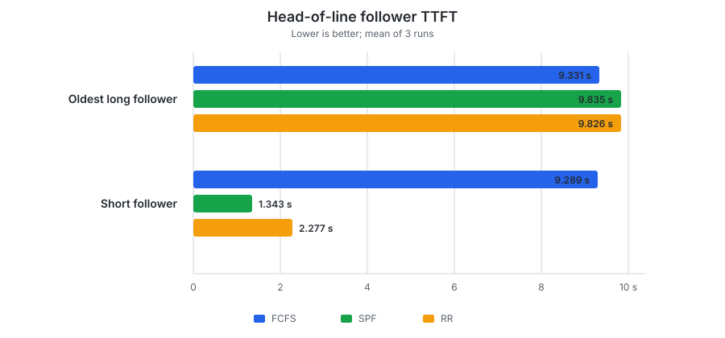
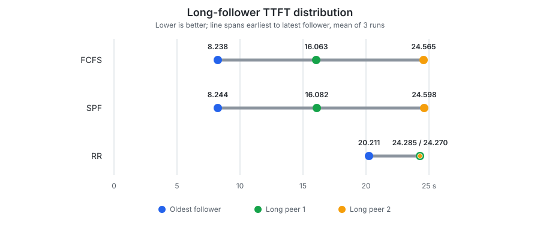

# Scheduling Policies

This benchmark follows the earlier
[continuous-batching report](continuous_batching.md), which compared serial
admission with continuous batching using the default policy (first come, first
served). This benchmark holds continuous batching constant and compares how the
engine orders competing prefills.

As a project-specific scheduling choice, `mini-vllm-rs` prioritizes active
decode requests, reserving one unit of the model iteration's token budget for
each decode it can fit before allocating any remaining budget to prefills. The
prefill policy therefore does not decide whether decode or prefill runs first;
it decides which active prefill receives the budget that remains after decode.

For speculative decoding, one scheduled decode unit may run the draft model for
multiple steps and produce multiple accepted tokens. This benchmark does not
configure a draft model, so speculative decoding is out of scope.

This benchmark compares 3 policies under a deliberately small 128-token batch
budget:

| Policy | Prefill behavior |
|---|---|
| **First come, first served (FCFS)** | Preserves arrival order and lets the oldest active prefill consume the remaining budget first. |
| **Shortest prefill first (SPF)** | Orders active prefills by their remaining token count, favoring requests that can begin decoding sooner. |
| **Round robin (RR)** | Preserves arrival order for admission, then rotates which active prefill receives the remaining budget first on each scheduling decision. |

The engine supports chunked prefill: a request whose remaining prompt exceeds
the current budget receives a partial prefill and continues in a later model
iteration. However, there is no separate per-request prefill cap. A request can
consume all budget remaining in an iteration, which makes the ordering policy
visible when several prefills compete.

**Scope:**

- The benchmark targets a single-node, single-user local inference engine. It
  studies responsiveness among a small number of concurrent requests, not
  datacenter fairness or high-concurrency serving.
- The workloads are diagnostic stress cases chosen to isolate differences
  between policies, not an estimate of typical local-inference traffic.
- All policies retain decode-first priority. Comparing decode and prefill with
  equal priority, or reserving a fixed per-request prefill quantum, is out of
  scope.
- Speculative decoding, output quality, memory use, and other models or devices
  are also out of scope.

## Reproducibility

| Item | Details |
|---|---|
| Hardware | Apple M2 with an 8-core CPU, 10-core GPU, and 16 GB of unified memory |
| Operating system | macOS 26.6.2 |
| Model | Qwen2.5 7B Instruct Q4_K_M |
| Revisions | [`mini-vllm-rs` `e5d2981`](https://github.com/lun0522/mini-vllm-rs/commit/e5d2981757480549b457bfefcaf651034f237d25) and [`mini-vllm-eval` `02b5a40`](https://github.com/lun0522/mini-vllm-eval/commit/02b5a40c40fb6500570360230165c364a5216250) |
| Procedure | Follow the `scheduling-policy-benchmark` skill in the `mini-vllm-eval` repository |
| Configuration | GPU inference with F32 activations, a paged KV cache with 16 tokens per page, a 1 GiB KV-cache budget, a maximum batched token count of 128, a maximum of 7 active requests, one input-preprocessing thread, and `MINI_VLLM_METAL_GEMV_MAX_ROWS=4` |
| Workloads | A 1-token warm-up on every fresh server, followed by either a short request arriving behind a long prefill or three similarly sized long prefills; the anchor generated 192 tokens, followers generated 16 tokens, and EOS was ignored |
| Measurements | 3 untraced runs reporting the mean and sample standard deviation; the maximum coefficient of variation among headline measurements was 3.80%, so the workflow did not require 2 additional runs |
| Thread settings | `CANDLE_NUM_THREADS` and `RAYON_NUM_THREADS` unset |

## Workloads

Each policy runs in a fresh server and first completes an unmeasured 1-token
warm-up. A measured anchor request then starts decoding. After its first
streamed token, the benchmark submits the oldest follower, waits 0.5 seconds,
and submits the remaining follower(s). This makes the intended arrival order
explicit while ensuring that every policy must first reserve budget for the
decoding anchor.

| Workload | Requests | Input tokens | Purpose |
|---|---:|---|---|
| Head of line | 3 | Anchor 128; oldest long follower 1,068; short follower 121 | Measures whether a short request must wait behind an older long prefill. |
| Long fairness | 4 | Anchor 123; oldest long follower 998; long peers 998 and 1,024 | Measures how sequential and rotating allocation distribute TTFT among similarly sized long prefills. |

The 128-token batch limit is much smaller than every long prompt. With the
anchor already decoding, at most 127 prefill tokens are available in a typical
iteration. The long requests must therefore make progress across multiple
scheduling decisions.

## Results

- **TTFT:** Time from client submission until the first streamed output.
- **Follower spread:** Difference between the latest and earliest follower
  TTFT.
- **Wall time:** Time from anchor submission until every measured request
  completes.
- **Output throughput:** Total generated tokens divided by wall time.

### A Short Request Behind a Long Prefill

1. FCFS repeatedly allocated the post-decode budget to the oldest long prefill.
   The short follower did not begin decoding until almost the same time as that
   long request.
2. SPF recognized that the 121-token prompt could complete in roughly one
   iteration and moved it ahead of the long prefill. It reduced short-follower
   TTFT from **9.289 to 1.343 seconds**, an **85.5% reduction** from FCFS.
3. RR prevented the long request from monopolizing every iteration, but did not
   optimize for completion time. Its short-follower TTFT was **2.277 seconds**,
   **75.5% lower** than FCFS but 0.934 seconds slower than SPF.

Both SPF and RR let the 121-token short follower consume one prefill allocation
before the long follower finished. Because about 127 prefill tokens remained
after scheduling the anchor's decode, the short prompt fit in that single
iteration. This delayed the long follower by about 0.5 seconds: its TTFT
increased by 5.4% with SPF and 5.3% with RR.

Anchor E2E and output throughput did not materially change across policies;
both remained within 1.5% of FCFS.

### Fairness Among Long Prefills

1. FCFS favored the oldest request: it reached its first token in 8.238 seconds,
   followed by the two peers at 16.063 and 24.565 seconds. This is useful when
   arrival order matters more than equalizing response times.
2. SPF behaved almost identically because the oldest follower and first peer
   both had 998 input tokens, while the final peer had 1,024. SPF is not
   inherently fair among similarly sized long requests; its advantage appears
   when prompt lengths differ enough for shorter work to finish earlier.
3. RR distributed partial prefill progress across all three followers. It
   reduced TTFT spread from **16.326 to 4.074 seconds**, approximately **75%
   lower** than FCFS, but delayed the oldest request from 8.238 to 20.211
   seconds, a 145.3% increase.

Maximum follower TTFT improved by only 1.1%, anchor E2E increased by 2.4%, and
throughput decreased by 2.3% with RR. The policy changed who waited much more
than it changed when all work finished.

## Conclusions

1. **FCFS is the best fit when arrival order should be preserved.** It gave the
   oldest long request the lowest TTFT, but a short request received no special
   treatment and similarly sized long requests completed their prefills
   sequentially.
2. **SPF is the best fit when prompt lengths are heterogeneous and interactive
   responsiveness favors short work.** It reduced the short-behind-long TTFT by
   85.5% while barely changing anchor latency or throughput in this workload.
3. **RR trades earliest-request latency for more even progress.** It
   reduced long-request TTFT spread by about 75%, but delayed the oldest long
   request by 145.3% and slightly reduced throughput. This is a distinct
   fairness tradeoff, not a universal improvement.

These two targeted workloads are not enough to change the project-wide default
from FCFS to SPF. Doing that would require a broader workload mix, including
prompt-length estimation accuracy, arrival patterns, starvation risk, and
workloads where preserving arrival order matters.

RR is most relevant when the user prefers several long concurrent requests to
become responsive around the same time. Its more even allocation could also be
useful in multi-user or multi-team serving, although a per-request prefill cap
could provide similar or stronger fairness within each iteration. That setting
is outside this single-user project's scope, and request-level policies alone
would not guarantee fairness between users who submit different numbers of
requests.

## Appendix: Complete Measurements

### Head-of-Line Summary

| Policy | Oldest long TTFT (s) | Short TTFT (s) | Follower max TTFT (s) | Anchor E2E (s) | Output (tok/s) |
|---|---:|---:|---:|---:|---:|
| FCFS | 9.331 ± 0.201 | 9.289 ± 0.201 | 9.331 ± 0.201 | 22.729 ± 0.770 | 9.857 ± 0.342 |
| SPF | 9.835 ± 0.251 | 1.343 ± 0.042 | 9.835 ± 0.251 | 22.406 ± 0.826 | 9.997 ± 0.380 |
| RR | 9.826 ± 0.259 | 2.277 ± 0.066 | 9.826 ± 0.259 | 22.461 ± 0.825 | 9.977 ± 0.377 |

### Head-of-Line Workload

| Policy | Role | Input | Output | TTFT (s) | E2E (s) |
|---|---|---:|---:|---:|---:|
| FCFS | Anchor | 128 | 192 | 0.867 ± 0.018 | 22.729 ± 0.770 |
| FCFS | Oldest long follower | 1,068 | 16 | 9.331 ± 0.201 | 12.276 ± 0.299 |
| FCFS | Short follower | 121 | 16 | 9.289 ± 0.201 | 11.873 ± 0.293 |
| SPF | Anchor | 128 | 192 | 0.870 ± 0.020 | 22.406 ± 0.826 |
| SPF | Oldest long follower | 1,068 | 16 | 9.835 ± 0.251 | 12.041 ± 0.344 |
| SPF | Short follower | 121 | 16 | 1.343 ± 0.042 | 10.551 ± 0.294 |
| RR | Anchor | 128 | 192 | 0.871 ± 0.023 | 22.461 ± 0.825 |
| RR | Oldest long follower | 1,068 | 16 | 9.826 ± 0.259 | 12.103 ± 0.364 |
| RR | Short follower | 121 | 16 | 2.277 ± 0.066 | 10.729 ± 0.317 |

### Long-Fairness Summary

| Policy | Oldest TTFT (s) | Later mean TTFT (s) | Follower max TTFT (s) | TTFT spread (s) | Anchor E2E (s) | Output (tok/s) |
|---|---:|---:|---:|---:|---:|---:|
| FCFS | 8.238 ± 0.196 | 20.314 ± 0.512 | 24.565 ± 0.620 | 16.326 ± 0.423 | 36.975 ± 1.186 | 6.490 ± 0.218 |
| SPF | 8.244 ± 0.201 | 20.340 ± 0.525 | 24.598 ± 0.635 | 16.355 ± 0.434 | 37.047 ± 1.172 | 6.480 ± 0.212 |
| RR | 20.211 ± 0.511 | 24.277 ± 0.623 | 24.285 ± 0.625 | 4.074 ± 0.114 | 37.845 ± 1.218 | 6.343 ± 0.206 |

### Long-Fairness Workload

| Policy | Role | Input | Output | TTFT (s) | E2E (s) |
|---|---|---:|---:|---:|---:|
| FCFS | Anchor | 123 | 192 | 0.867 ± 0.019 | 36.975 ± 1.186 |
| FCFS | Oldest long follower | 998 | 16 | 8.238 ± 0.196 | 23.921 ± 0.591 |
| FCFS | Long peer 1 | 998 | 16 | 16.063 ± 0.405 | 25.885 ± 0.686 |
| FCFS | Long peer 2 | 1,024 | 16 | 24.565 ± 0.620 | 26.859 ± 0.728 |
| SPF | Anchor | 123 | 192 | 0.864 ± 0.017 | 37.047 ± 1.172 |
| SPF | Oldest long follower | 998 | 16 | 8.244 ± 0.201 | 23.945 ± 0.601 |
| SPF | Long peer 1 | 998 | 16 | 16.082 ± 0.416 | 25.913 ± 0.696 |
| SPF | Long peer 2 | 1,024 | 16 | 24.598 ± 0.635 | 26.890 ± 0.736 |
| RR | Anchor | 123 | 192 | 0.872 ± 0.024 | 37.845 ± 1.218 |
| RR | Oldest long follower | 998 | 16 | 20.211 ± 0.511 | 27.527 ± 0.743 |
| RR | Long peer 1 | 998 | 16 | 24.285 ± 0.625 | 27.762 ± 0.774 |
| RR | Long peer 2 | 1,024 | 16 | 24.270 ± 0.621 | 27.747 ± 0.770 |
