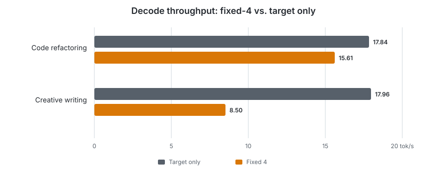
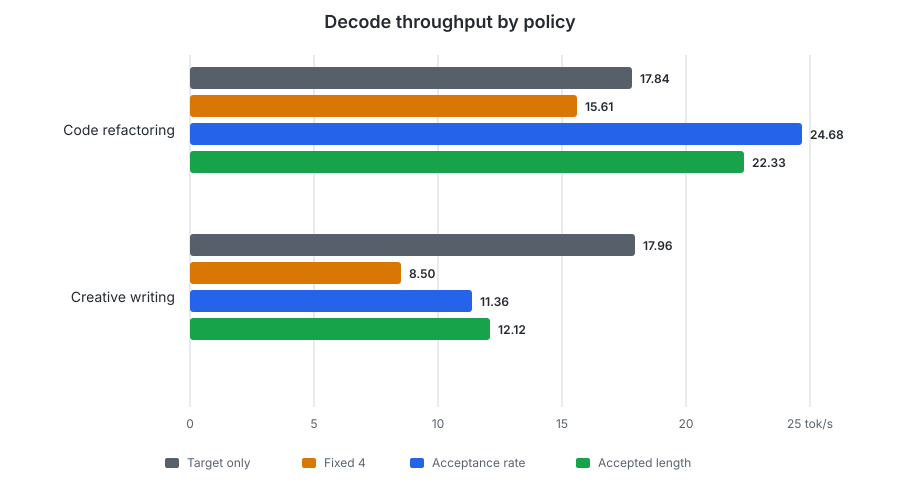
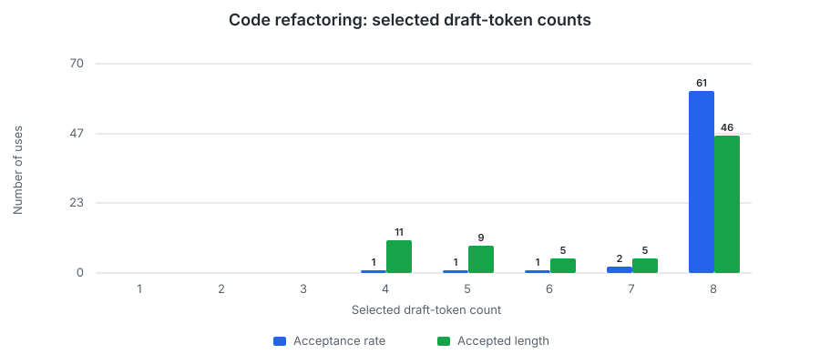
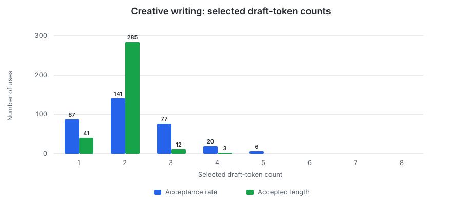
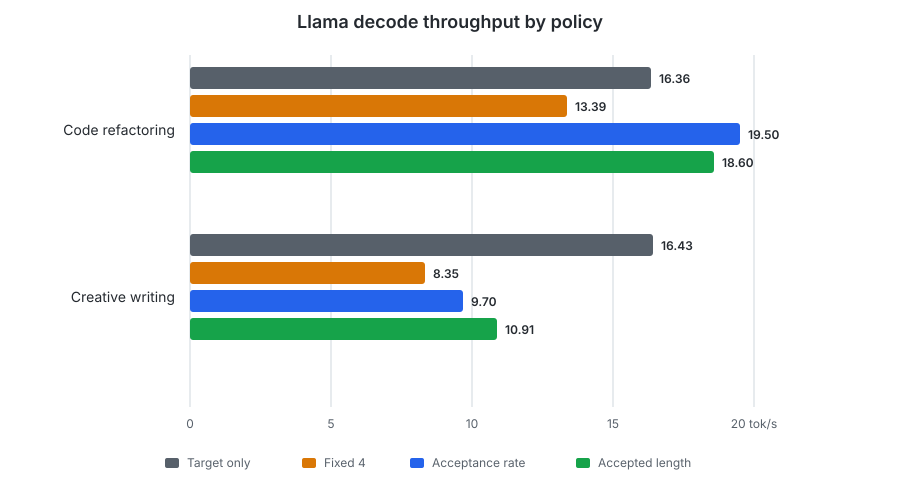
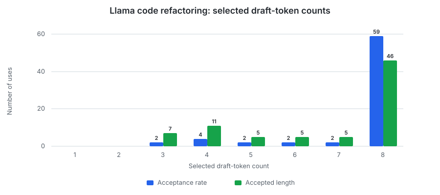
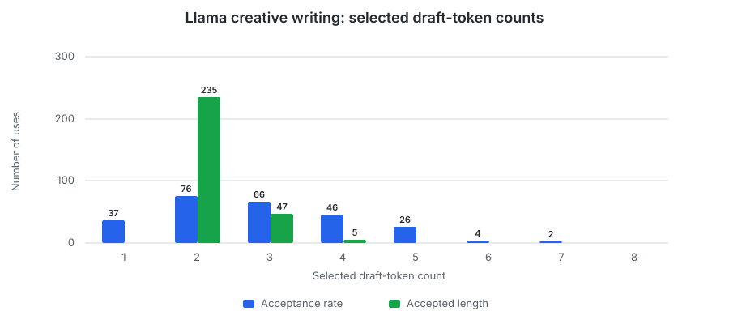

# Speculative Decoding Policies

Speculative decoding uses a smaller model to draft several tokens, then verifies
them with the target model in one forward pass. Its benefit depends on how many
draft tokens the target accepts and whether reducing sequential target steps
outweighs the cost of running the draft model.

Other speculative decoding methods, such as multi-token prediction (MTP),
require model-specific training and runtime support. Some locally runnable
models provide these capabilities, but this project does not yet support them.
We therefore focus on conventional draft-and-verify, which only requires the
target and draft models to share a tokenizer and vocabulary. Qwen2.5 is the
primary experiment; a compatible Llama pair provides a model-family comparison.

The implementation still separates model configuration, request-local policy
state, generation, verification, KV-cache management, and statistics behind
clean interfaces. KV-cache management keeps the target and draft caches
synchronized after verification, including truncating entries for rejected
draft tokens.

## Scope

- Developing other speculative algorithms or specially trained models, and
  searching for the optimal target/draft model pair, are out of scope.
- Output-quality scoring, concurrent-request performance, and memory usage are
  also out of scope.

## Reproducibility

| Item | Details |
|---|---|
| Hardware | Apple M2 with an 8-core CPU, 10-core GPU, and 16 GB of unified memory |
| Operating system | macOS 26.6.2 |
| Models | Qwen2.5 7B/0.5B Instruct Q4_K_M for the Qwen results and Llama 3.1 8B/Llama 3.2 1B Instruct Q4_K_M for the Llama results; target-only cases omit the draft model, while standalone draft-model cases run it as the primary model |
| Revisions | [`mini-vllm-rs` `96bad41`](https://github.com/lun0522/mini-vllm-rs/commit/96bad413a9381c114a926cd95726e3449cd8b724) and [`mini-vllm-eval` `07ebdf0`](https://github.com/lun0522/mini-vllm-eval/commit/07ebdf070842b10e82c6d68d583a558fbbde2b21) |
| Procedure | Follow the `speculative-decoding-benchmark` skill in the `mini-vllm-eval` repository and select `speculative_decoding_qwen` or `speculative_decoding_llama` |
| Configuration | GPU inference with F32 activations, a contiguous 1 GiB target KV cache, a maximum batched token count of 1024, and `MINI_VLLM_METAL_GEMV_MAX_ROWS=4` |
| Workload | A 1-token warm-up followed by code-refactoring and creative-writing requests, each generating exactly 512 tokens with EOS ignored; their input lengths were 881/845 tokens for Qwen and 884/844 for Llama |
| Measurements | Each configuration was measured 5 times without tracing; results report the mean and sample standard deviation. Three initial runs exceeded 5% coefficient of variation only for standalone draft-model measurements, triggering 2 additional complete runs for each model family. After 5 runs, Qwen's maximum was 4.95%. Llama's maximum was 6.79%, occurring only when the Llama draft model generated the code-refactoring response by itself; every Llama target-only and speculative-policy measurement was below 5% |
| Thread settings | `CANDLE_NUM_THREADS` and `RAYON_NUM_THREADS` unset |

Generated text was not required to match across configurations. Different
target execution shapes can produce small numerical differences and therefore
slightly different wording or formatting, despite identical prompts and output
limits.

## Implementation

Our implementation provides three draft-token count policies: fixed,
acceptance rate, and accepted length. The server uses one configured policy for
all requests, while each request has independent controller state. After target
verification, the controller may update the next proposal length.

| Policy | Behavior | Benchmark settings |
|---|---|---|
| Fixed | Always proposes the configured count. | Count 4 |
| Acceptance rate | Changes the count by ±1 when the latest `accepted / proposed` ratio crosses its thresholds. | Initial 4, thresholds 0.4/0.8, bounds 1–8 |
| Accepted length | Tracks the exponential moving average `s = α × accepted + (1 - α) × previous s`, then selects `round(s) + 1` within its bounds. The extra token probes beyond the recently accepted prefix. | Initial 4, `α = 0.2`, bounds 1–8 |

## Qwen2.5 Results

Exact throughput and latency measurements are in the
[Qwen complete-measurements table](#qwen-complete-measurements). The appendix
also separates the [dynamic-policy speedups](#qwen-dynamic-policy-speedups) and
[draft-token acceptance totals](#qwen-draft-token-acceptance).

### A Fixed Proposal Length Regressed

We first compared target-only decoding with a fixed proposal length of 4.
Fixed-4 was **12.5% slower** on the code-refactoring prompt and **52.7%
slower** on the creative-writing prompt.

The draft statistics explain why one proposal length does not fit both
workloads:

| Workload | Fixed-4 acceptance | Accepted/proposed | Average accepted per verification |
|---|---:|---:|---:|
| Code refactoring | 98.6% | 509/516 | 3.95 |
| Creative writing | 31.1% | 299/962 | 1.24 |

The average is the accepted-token total divided by the number of fixed-4
histogram uses.

- The code-refactoring prompt accepted nearly all 4 proposed tokens on average,
  so 4 was too conservative to amortize the draft-model work.
- The creative-writing prompt accepted little more than one, so most of each
  4-token proposal added work without eliminating target-model steps.

The model-size difference does not make drafting free: the 7B target has only
14 times as many parameters as the 0.5B draft, and every proposal requires
sequential draft-model steps. Unless enough of those tokens are accepted, that
work can cost more than the target steps it replaces.

### Dynamic Proposal Lengths Helped

We then added the acceptance-rate and accepted-length policies. Both improved
decode throughput over fixed-4 on both workloads:

- For the code-refactoring prompt, the acceptance-rate policy exceeded
  target-only throughput by **38.3%**, while accepted length exceeded it by
  **25.2%**.
- For the creative-writing prompt, both reduced the proposal length and
  recovered a substantial part of the fixed-4 regression, but neither beat
  target-only decoding.

The selected-count histograms were identical across all five runs and show how
each policy adapted to the two workloads:

- For the code-refactoring prompt, the acceptance-rate policy spent 61 of 66
  selections at the upper bound of 8, while the accepted-length policy spent
  46 of 76 there and otherwise used counts from 4 through 7. This confirms that
  the fixed count of 4 was too low for this prompt.
- For the creative-writing prompt, the acceptance-rate policy made 305 of 331
  selections between 1 and 3, while the accepted-length policy selected 2
  tokens 285 of 341 times. Both policies recognized that longer proposals
  mostly created rejected work for this prompt.

## Llama Results

We repeated the same benchmark with Llama 3.1 8B as the target and Llama 3.2 1B
as the draft. The prompts and runtime settings were unchanged; Llama tokenized
them to 884 and 844 input tokens.

Exact throughput and latency measurements are in the
[Llama complete-measurements table](#llama-complete-measurements), with
[dynamic-policy speedups](#llama-dynamic-policy-speedups) and
[draft-token acceptance totals](#llama-draft-token-acceptance) shown
separately.

- The Llama draft was not uniformly less predictive. Compared with Qwen, its
  fixed-4 acceptance was lower for code refactoring (**96.9% vs. 98.6%**) but
  higher for creative writing (**42.2% vs. 31.1%**).
- The larger models were slower as expected: Llama target-only decode was 8.3%
  slower for code and 8.5% slower for creative writing. Relative to Qwen,
  target-only TTFT increased by 12.6–14.1% and speculative TTFT by 23.3–25.7%
  because both the target and draft must process the prompt.
- Both dynamic policies beat Llama target-only on code refactoring, by 19.2%
  for acceptance rate and 13.7% for accepted length, but neither beat it on
  creative writing. Qwen has a 14:1 target-to-draft parameter ratio (7B/0.5B),
  while Llama has only an 8:1 ratio (8B/1B). The standalone runs of the
  [Qwen draft model](#qwen-standalone-draft-model-measurements) and
  [Llama draft model](#llama-standalone-draft-model-measurements) confirm that the
  relatively larger Llama draft was slower, so even its better creative-writing
  predictions did not produce higher throughput.

The Llama histograms show the same split as Qwen for these prompts: the
code-refactoring prompt favors longer proposals, while the creative-writing
prompt favors shorter ones.

## Conclusions and Future Work

1. A fixed proposal length of 4 was slower than target-only decoding for both
   tested prompts and model families. Adapting the proposal length improved
   every speculative case over fixed-4.
2. Speculative decoding helped most when predictions were both accurate and
   cheap. On the code-refactoring prompt, the acceptance-rate policy increased
   decode throughput over target-only by 38.3% with Qwen and 19.2% with Llama.
   Neither model family exceeded target-only decode throughput on the
   creative-writing prompt.
3. A higher acceptance rate alone does not guarantee higher throughput. The
   Llama draft predicted creative writing better than the Qwen draft, but its
   smaller 8:1 target-to-draft parameter ratio increased draft cost enough to
   outweigh that advantage.

Further work should prioritize cheaper or more accurate speculation rather than
only tuning proposal-length policies. Multi-token prediction (MTP) is the most
promising next step: models with trained MTP heads can propose several tokens
without running a separate autoregressive draft model. A cost-aware controller
could also fall back to target-only decoding when recent proposals do not repay
their cost. For local inference, both directions should be evaluated primarily
for memory footprint, memory bandwidth, and per-step overhead. Continuous
batching remains relevant, but it should be measured at the modest concurrency
levels that fit local memory rather than assuming datacenter-scale batches.

## Appendix

### Qwen Dynamic-Policy Speedups

This table focuses on the two dynamic policies and makes their decode-throughput
improvement over fixed-4, and their standing relative to target-only decoding,
explicit.

| Workload | Policy | Decode throughput (tok/s) | vs. fixed-4 | vs. target only |
|---|---|---:|---:|---:|
| Code refactoring | Acceptance rate | 24.684 ± 0.606 | 1.581× | 1.383× |
| Code refactoring | Accepted length | 22.330 ± 0.538 | 1.431× | 1.252× |
| Creative writing | Acceptance rate | 11.356 ± 0.421 | 1.336× | 0.632× |
| Creative writing | Accepted length | 12.116 ± 0.450 | 1.425× | 0.675× |

### Qwen Draft-Token Acceptance

Unlike the speedup table, this table measures draft efficiency: the share and
total number of proposed tokens accepted by the target. These values were
identical across all five runs.

| Workload | Policy | Acceptance | Accepted/proposed |
|---|---|---:|---:|
| Code refactoring | Fixed 4 | 98.6% | 509/516 |
| Code refactoring | Acceptance rate | 98.5% | 509/517 |
| Code refactoring | Accepted length | 97.9% | 509/520 |
| Creative writing | Fixed 4 | 31.1% | 299/962 |
| Creative writing | Acceptance rate | 42.1% | 299/710 |
| Creative writing | Accepted length | 45.4% | 299/659 |

### Qwen Complete Measurements

This table includes every configuration and records the token counts and
latency measurements in addition to decode throughput.

| Workload | Configuration | Input tokens | Output tokens | Decode throughput (tok/s) | vs. target | vs. fixed | E2E latency (s) | TTFT (ms) |
|---|---|---:|---:|---:|---:|---:|---:|---:|
| Code refactoring | Target only | 881 | 512 | 17.842 ± 0.715 | 1.000× | 1.143× | 36.268 ± 1.264 | 7592.92 ± 137.61 |
| Code refactoring | Fixed 4 | 881 | 512 | 15.608 ± 0.545 | 0.875× | 1.000× | 41.699 ± 1.346 | 8928.65 ± 228.18 |
| Code refactoring | Acceptance rate 1–8 | 881 | 512 | 24.684 ± 0.606 | 1.383× | 1.581× | 29.473 ± 0.659 | 8761.49 ± 166.43 |
| Code refactoring | Accepted length 1–8 | 881 | 512 | 22.330 ± 0.538 | 1.252× | 1.431× | 31.681 ± 0.715 | 8785.97 ± 185.17 |
| Creative writing | Target only | 845 | 512 | 17.960 ± 0.679 | 1.000× | 2.112× | 35.627 ± 1.253 | 7143.03 ± 174.10 |
| Creative writing | Fixed 4 | 845 | 512 | 8.502 ± 0.250 | 0.473× | 1.000× | 68.579 ± 1.981 | 8429.03 ± 231.33 |
| Creative writing | Acceptance rate 1–8 | 845 | 512 | 11.356 ± 0.421 | 0.632× | 1.336× | 53.397 ± 1.896 | 8341.49 ± 158.81 |
| Creative writing | Accepted length 1–8 | 845 | 512 | 12.116 ± 0.450 | 0.675× | 1.425× | 50.592 ± 1.801 | 8370.55 ± 190.18 |

### Qwen Standalone Draft-Model Measurements

This is ordinary generation by the draft model, not isolated timing of draft
execution inside the speculative loop.

| Workload | Input tokens | Output tokens | Decode throughput (tok/s) | vs. target | E2E latency (s) | TTFT (ms) |
|---|---:|---:|---:|---:|---:|---:|
| Code refactoring | 881 | 512 | 109.970 ± 5.449 | 6.164× | 5.815 ± 0.259 | 1158.97 ± 26.25 |
| Creative writing | 845 | 512 | 112.258 ± 3.450 | 6.250× | 5.630 ± 0.166 | 1074.06 ± 20.99 |

### Llama Dynamic-Policy Speedups

| Workload | Policy | Decode throughput (tok/s) | vs. fixed-4 | vs. target only |
|---|---|---:|---:|---:|
| Code refactoring | Acceptance rate | 19.502 ± 0.209 | 1.456× | 1.192× |
| Code refactoring | Accepted length | 18.600 ± 0.343 | 1.389× | 1.137× |
| Creative writing | Acceptance rate | 9.702 ± 0.062 | 1.162× | 0.590× |
| Creative writing | Accepted length | 10.906 ± 0.066 | 1.307× | 0.664× |

### Llama Draft-Token Acceptance

The acceptance totals and selected-count histograms were identical across all
five runs.

| Workload | Policy | Acceptance | Accepted/proposed |
|---|---|---:|---:|
| Code refactoring | Fixed 4 | 96.9% | 507/523 |
| Code refactoring | Acceptance rate | 96.4% | 507/526 |
| Code refactoring | Accepted length | 97.5% | 507/520 |
| Creative writing | Fixed 4 | 42.2% | 356/844 |
| Creative writing | Acceptance rate | 48.3% | 357/739 |
| Creative writing | Accepted length | 56.4% | 356/631 |

### Llama Complete Measurements

| Workload | Configuration | Input tokens | Output tokens | Decode throughput (tok/s) | vs. target | vs. fixed | E2E latency (s) | TTFT (ms) |
|---|---|---:|---:|---:|---:|---:|---:|---:|
| Code refactoring | Target only | 884 | 512 | 16.360 ± 0.636 | 1.000× | 1.222× | 39.817 ± 1.367 | 8550.34 ± 194.92 |
| Code refactoring | Fixed 4 | 884 | 512 | 13.390 ± 0.296 | 0.818× | 1.000× | 49.184 ± 0.885 | 11004.76 ± 35.16 |
| Code refactoring | Acceptance rate 1–8 | 884 | 512 | 19.502 ± 0.209 | 1.192× | 1.456× | 37.220 ± 0.347 | 11015.06 ± 78.48 |
| Code refactoring | Accepted length 1–8 | 884 | 512 | 18.600 ± 0.343 | 1.137× | 1.389× | 38.482 ± 0.553 | 10997.84 ± 47.83 |
| Creative writing | Target only | 844 | 512 | 16.434 ± 0.200 | 1.000× | 1.969× | 39.249 ± 0.543 | 8152.07 ± 197.76 |
| Creative writing | Fixed 4 | 844 | 512 | 8.346 ± 0.082 | 0.508× | 1.000× | 71.668 ± 0.654 | 10430.12 ± 82.88 |
| Creative writing | Acceptance rate 1–8 | 844 | 512 | 9.702 ± 0.062 | 0.590× | 1.162× | 63.053 ± 0.376 | 10381.32 ± 51.42 |
| Creative writing | Accepted length 1–8 | 844 | 512 | 10.906 ± 0.066 | 0.664× | 1.307× | 57.253 ± 0.307 | 10401.60 ± 56.18 |

### Llama Standalone Draft-Model Measurements

| Workload | Input tokens | Output tokens | Decode throughput (tok/s) | vs. target | E2E latency (s) | TTFT (ms) |
|---|---:|---:|---:|---:|---:|---:|
| Code refactoring | 884 | 512 | 73.598 ± 4.998 | 4.499× | 9.127 ± 0.476 | 2158.77 ± 13.77 |
| Creative writing | 844 | 512 | 72.118 ± 3.200 | 4.388× | 9.122 ± 0.308 | 2026.13 ± 33.99 |
