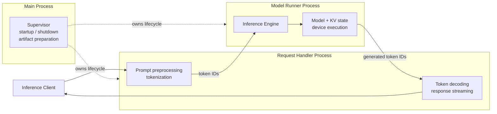
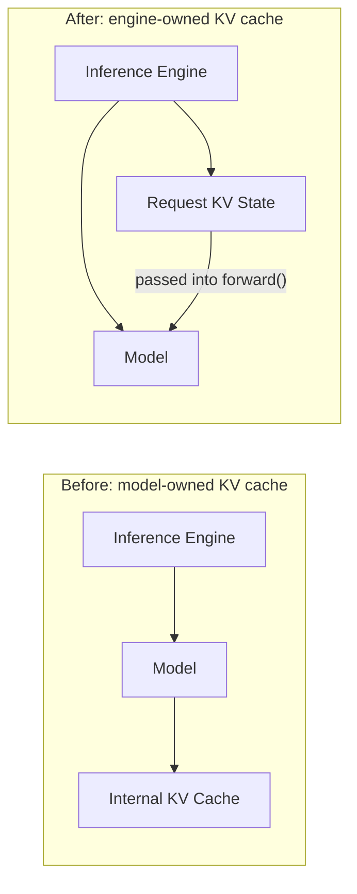
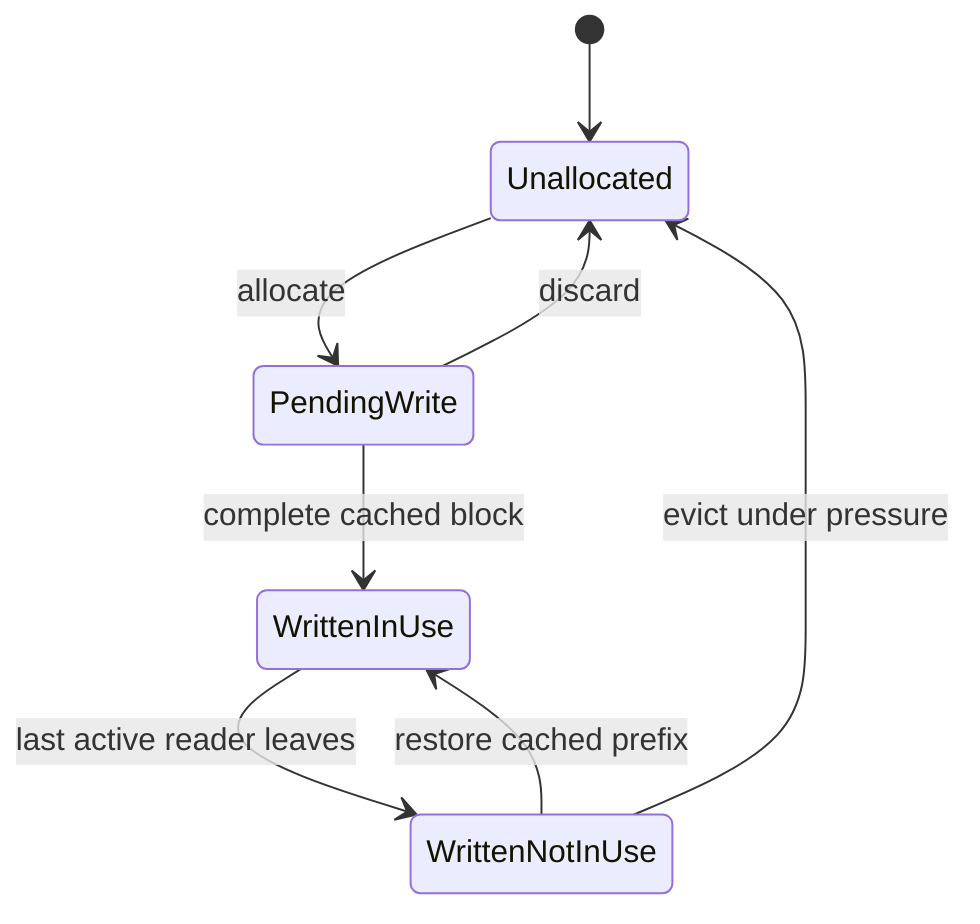
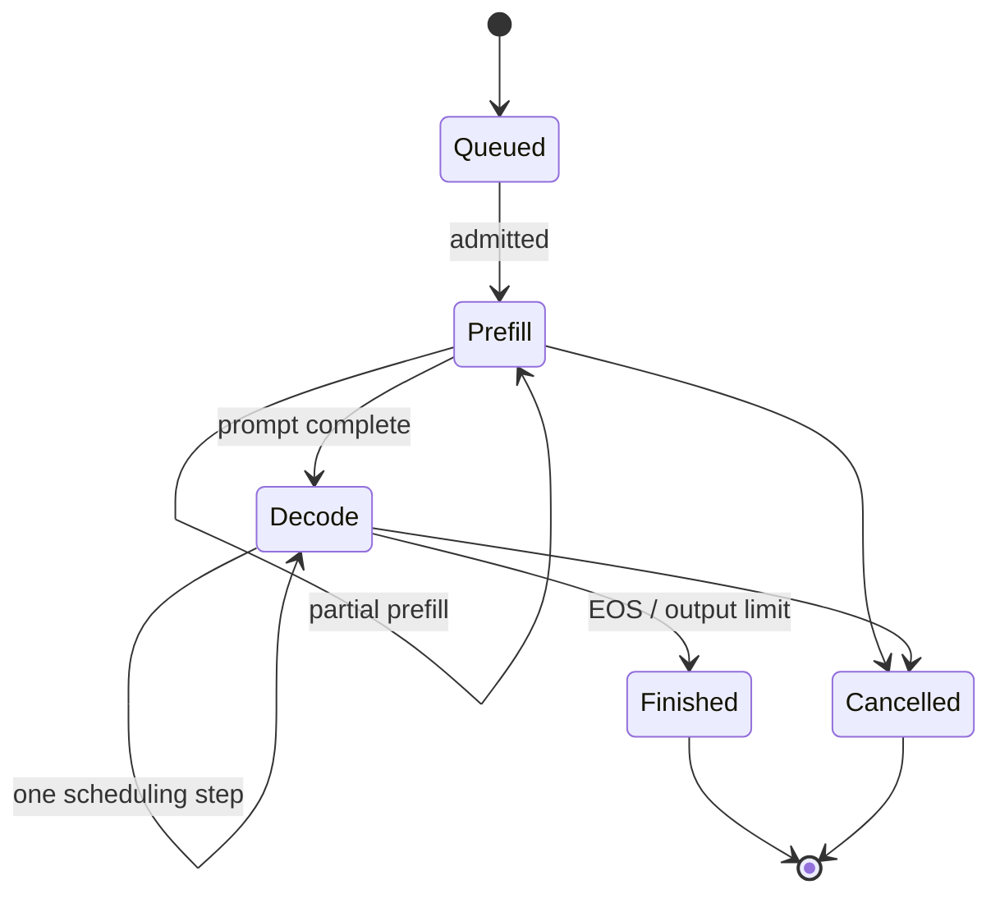
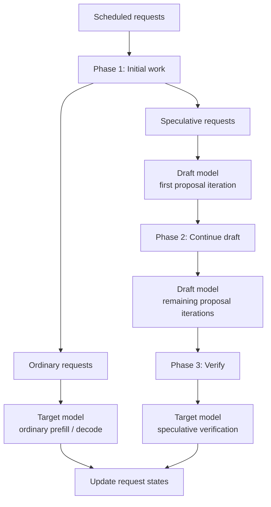
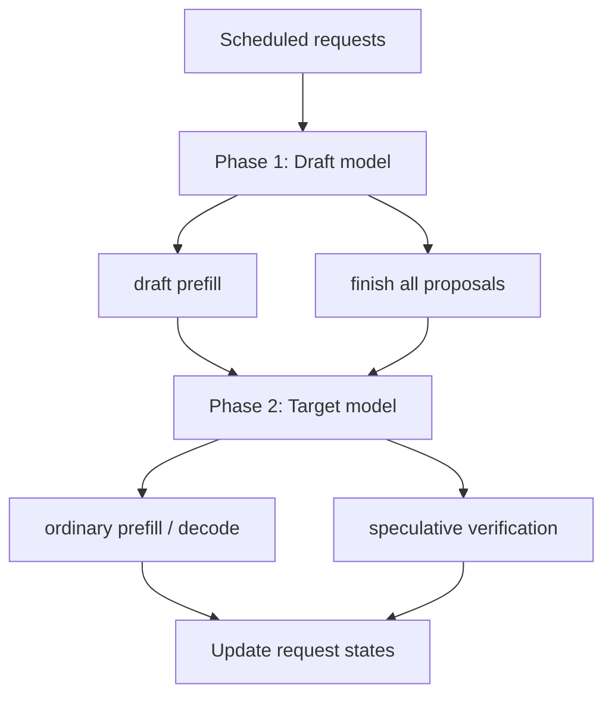
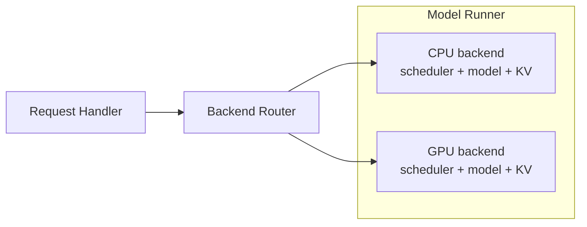
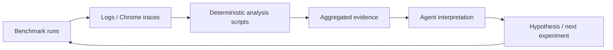

# Building an LLM Inference Engine with AI: The Code Was the Easy Part

*What continuous batching, KV-cache ownership, speculative decoding, and performance regressions taught me about AI-assisted systems engineering.*

## TL;DR

This post is about what systems engineering looks like when AI makes implementation much cheaper, but understanding the system, choosing the right abstractions, and reasoning about performance remain hard. It is also about how I learned to use AI beyond code generation—as a partner for exploring unfamiliar designs, investigating surprising behavior, and building more reliable engineering workflows.

## Introduction

I spent about a month building [mini-vllm-rs](https://github.com/lun0522/mini-vllm-rs), a small LLM inference engine in Rust, with AI writing a substantial fraction of the implementation.

I started the project because I had already spent time learning how modern LLM inference systems work and wanted to implement the mechanisms myself. I understood ideas such as continuous batching, PagedAttention, prefix caching, and speculative decoding conceptually, but I wanted to see what engineering complexity was hiding underneath them.

AI made that exploration much faster. It could propose designs, implement large changes, inspect unfamiliar framework internals, run experiments, and analyze traces. What surprised me was that implementation speed quickly stopped being the main constraint. The harder part became understanding the system well enough to decide whether a generated design was actually the design I wanted, and whether a plausible optimization was really an optimization.

## Starting with the smallest thing that could work

My development machine was an ordinary Mac mini, which made the project scope fairly natural. I was not trying to reproduce the infrastructure required to serve a large model across a GPU cluster. I wanted a real inference architecture on one machine, using locally runnable models while still supporting the serving techniques I was interested in.

Before starting, I looked at systems such as vLLM and SGLang to understand how mature engines divided responsibilities. I deliberately did not copy their topology. Their architectures solve problems such as distributed workers, many accelerators, fault handling, and production serving APIs that my project did not have.

On the first day, I used Candle to load a local model and generate text from a prompt. Conceptually, the system was little more than:

```text
prompt → tokenizer → model.forward() → decode loop → text
```

That was enough to establish the baseline. From there, the project became less about making a model answer a prompt and more about deciding what kind of system should exist around the model.

## Some architecture decisions did not come from LLM inference

By the end of the second day, the single-process prototype had already started turning into three long-lived processes: a main process, a request handler, and a model runner. Continuous batching did not exist yet, nor did most of the cache management or scheduling machinery that came later. I did not know exactly how those features would eventually fit together.

What I did have was a strong opinion about how I wanted a long-lived system to be structured, largely from my previous work on **crosvm on Windows**.

In crosvm, a broker launches and monitors child processes, while work such as GPU and UI handling can live separately from networking and other services. Stronger crosvm configurations also use sandboxing to constrain which resources each process can access. `mini-vllm-rs` does not implement that kind of sandboxing, so the analogy is architectural rather than a security claim. What transferred was the mental model of explicit ownership and lifecycle boundaries.

The prototype therefore evolved toward:



The main process owns lifecycle and prepares model artifacts. The request handler owns preprocessing and response streaming. The model runner owns the expensive model and device state.

I did not choose these boundaries because I had already anticipated continuous batching or speculative decoding. Those benefits appeared later. I chose them because explicit ownership was already a pattern I trusted.

The same reasoning kept me from adding infrastructure just because larger systems had it. I did not need an HTTP or OpenAI-compatible API for a local experiment, so protobuf over Unix sockets was enough. I tried to borrow ideas from mature inference systems without inheriting problems my system did not have.

## KV-cache ownership became the first inference-specific boundary

One of the first inference features I wanted to explore was paged KV caching. In retrospect, I probably implemented its foundation earlier than a product roadmap would have justified, but PagedAttention was one of the mechanisms I most wanted to understand by building it.

While reading Candle's model implementations, I noticed that KV state lived inside model layers and was cleared between requests. That is a reasonable abstraction for a general-purpose ML framework, but it becomes restrictive once the inference engine needs to decide which request owns which cache pages, when those pages can be reused, and what happens during cancellation or prefix reuse.

I therefore moved request-specific KV state out of the model and into the inference engine. Instead of the model implicitly owning its cache, the engine now owned the request state and passed the relevant KV cache into model execution.



This was a relatively small structural change, but it put ownership at the layer that would eventually need to make serving decisions. Later features could reason about KV state independently of the model that happened to consume it.

I stopped short of writing a true paged-attention kernel. The cache could use paged allocation while attention still reconstructed contiguous K and V tensors. A custom kernel would have been a much larger optimization effort while basic serving features were still missing.

That distinction became useful throughout the project: I was willing to make relatively cheap structural changes early when they removed future constraints, but I did not want to implement every expensive optimization that those changes made possible.

## Prefix caching was really a memory-lifetime problem

Prefix caching initially sounded like a lookup problem to me: identify the longest cached prefix, restore its KV pages, and skip the corresponding prefill work. Once I started implementing it, however, the harder question became what should happen to those pages after the request using them had finished.

The initial design, largely proposed by AI, used conventional reference counting. Active requests held references to the physical pages they were using, while the prefix index could retain references to completed pages. This seemed reasonable at first, and I was mostly trying to understand the design rather than replace it.

While reviewing the lifecycle, though, I started questioning what should happen when the last active request released a cached page. If there was no memory pressure, why free a page containing a reusable prefix? Keeping it around was the point of prefix caching. It should remain available for a future request, while still being reclaimable when memory was actually needed.

That meant “no active request is using this page” and “this page is free” were different states. Reference counting could still encode the distinction—for example, by retaining a reference on behalf of the prefix cache—but then the count was no longer just a count. A particular value also implicitly meant “cached but idle, and eligible for eviction.” I found that harder to reason about than representing the lifecycle directly.

I asked the agent to replace the refcount-based representation with an explicit state machine:



Now the important invariants were visible in the representation itself. Only `PendingWrite` is mutable; an idle cached page remains reusable as `WrittenNotInUse`, but can be evicted under memory pressure.

This was also one of the places where my interaction with AI changed as I learned the domain. The agent had given me a plausible design for a mechanism I did not yet understand deeply. Reviewing it helped me build the mental model needed to challenge the abstraction and ask for a representation whose invariants were clearer to me.

## Continuous batching forced generation to become resumable

Continuous batching was the first feature that showed me how much implementation could hide beneath a concept I already understood at a high level. I knew why an inference engine should interleave requests instead of running a static batch to completion. I did not know how many parts of the generation path had to change to make that possible.

I asked AI for an implementation plan, and it proposed roughly ten steps. Before it started coding, I explicitly asked it to keep changes small and incremental, using the size of my previous commits as a reference. A few hundred changed lines was roughly the amount I could realistically review at once.

Even with that constraint, an individual step would occasionally expand into a 600- or 700-line patch. When that happened, I asked the agent to split it further. This was not mainly about Git history. In a domain I was still learning, implementation could advance faster than my ability to build a reliable mental model of the code.

The first important architectural change was making generation resumable. Initially, a request entered a generation function and stayed there until completion. A scheduler cannot meaningfully interleave work if request execution is fundamentally run-to-completion.

Generation therefore became persistent request state:



A request could advance one prefill chunk or one decode iteration and return control to the scheduler. Admission, token budgets, chunked prefill, and interleaving were then layered on top over a sequence of working commits.

Some intermediate abstractions were intentionally temporary. The point was not to predict the final architecture in one attempt, but to keep each change small enough that I could understand what new capability it introduced. In practice, those small steps became one of the main ways I learned inference-system design.

## Speculative decoding tested whether the abstractions composed

Speculative decoding touched many existing parts of the engine: target and draft models, separate KV caches, rollback after rejected tokens, request-local state, scheduling, and batching. Once the KV commit and rollback interfaces were clean, basic speculative decoding was relatively straightforward. Combining it with continuous batching exposed more architectural choices.

At one point during review, the agent proposed a three-phase execution structure. The first phase mixed two different kinds of work: ordinary requests executed a target-model step while speculative requests executed the first draft-model iteration. A second phase continued the remaining draft proposal iterations, and a third phase returned to the target model for verification.



The design was functionally plausible, but I found it unnecessarily difficult to reason about. “Phase 1” did not correspond to one model or one coherent category of work. Draft execution was split across two conceptual phases, while target execution appeared both before and after it.

I asked the agent to reorganize the step around a simpler rule: finish all draft-model work first, then run the target model.



The committed implementation reflects that structure. Draft prefill and proposal generation complete first. Ordinary target work and speculative verification then happen after proposals are ready, and a later refactor combined them into one target-model pass.

I cared primarily about the simpler execution model rather than a measured performance benefit. Avoiding unnecessary target/draft switching might improve locality, but I never benchmarked that hypothesis.

Later I also removed much of the word `batch` from the model interfaces. Batching had started as an alternate path; eventually packed multi-request execution was simply how model execution worked. Keeping the historical terminology would have made the code describe its evolution rather than its current architecture.

## Clean backend ownership made heterogeneous execution surprisingly cheap

I later added independent CPU and GPU inference backends. Mature inference systems often have much heavier abstractions around workers and devices, but on a single Apple Silicon machine I did not need to solve problems such as distributed coordination or accelerator fault isolation. I mainly needed a clean way for two execution backends to coexist.

The design ended up being simple: each backend runs on its own thread and owns its scheduler, model instances, and KV caches. Whole requests are assigned round-robin rather than split across devices.



What surprised me was how little restructuring this required. By this point, the scheduler, model state, and KV state already had clear owners. Supporting another backend mostly meant creating another independent owner of the same set of resources and routing requests between them. I had not designed those earlier boundaries specifically for heterogeneous execution, but this was a useful test of whether they composed beyond the features that originally motivated them.

I did consider a more interesting design: using the GPU for prefill and the CPU for decode. Apple Silicon's unified memory makes that idea especially tempting, since CPU and GPU physically share memory, and some of my CPU experiments had made CPU decode look promising. But the software abstractions were not unified in the same way. Candle tensors are still associated with a device, so moving a request between backends would also mean dealing with cross-device tensor and KV-cache ownership.

At that point, the feature would no longer have been a small extension of the existing architecture; it would have required much deeper changes, potentially including changes in Candle itself. I left that as a future experiment and kept the implemented version deliberately simpler: independent CPU and GPU backends, with whole requests assigned between them.

## Performance repeatedly disagreed with my intuition

I did not initially set out to build a benchmark suite. I started writing simple benchmarks because each new feature created obvious questions about latency or throughput, and performance regressions kept giving me reasons to make the measurements more rigorous. The detailed reports live in the [`benchmarks`](https://github.com/lun0522/mini-vllm-rs/tree/main/benchmarks) directory, with the harness and analysis tooling in [mini-vllm-eval](https://github.com/lun0522/mini-vllm-eval).

Three experiments were especially useful because each contradicted a reasonable expectation in a different way.

### Continuous batching made Metal decode slower

After continuous batching worked, I expected decoding two active requests together to improve GPU utilization. Instead, a target-only Metal benchmark showed a severe decode regression.

With two requests generating 512 tokens each, sequential execution achieved about **16.8 output tokens/s**, while continuous batching achieved only **8.7 tokens/s**. Time to first token remained roughly in the same range, but end-to-end latency nearly doubled, pointing toward the repeatedly executed decode path rather than prefill as the main problem.

I did not yet have detailed tracing, so I gave the agent a narrower question: batching had changed the matrix dimensions during decode; which Candle operations or backend dispatch paths changed because of that shape?

The agent traced the difference into Candle's Metal quantized-matmul implementation. Sequential decode had `M = 1`, which selected an optimized GEMV path. Packing two requests changed that dimension to `M = 2`, causing Candle to use its generic GEMM path. For such a small matrix, the generic path was much slower.

I added a configurable small-row fallback that split those matrices back into GEMV operations. Further measurements showed a crossover: GEMV was better for the smallest batches, while GEMM became preferable as the row count grew. The experiment and threshold selection are documented in the [Metal GEMV benchmark](https://github.com/lun0522/mini-vllm-rs/blob/main/benchmarks/metal_gemv_threshold.md).

The agent was unusually effective once I had reduced the question from “why is batching slow?” to “what backend behavior changed when this dimension changed?”

### F16 reduced memory and initially destroyed CPU performance

The F16 experiment produced a different surprise. I expected F16 activations and KV state to use less memory and potentially improve performance. The memory result was good: native F16 reduced measured peak RSS growth by about **60%**.

CPU performance, however, became dramatically worse. Decode throughput dropped from about **34.3 tokens/s** to **16.4 tokens/s**, while large-prefill latency increased from roughly **15.4 seconds** to **50.6 seconds**.

By then I had added Perfetto-compatible tracing, a technique that felt natural from my previous crosvm performance work. My first hypothesis was that unquantized attention should actually benefit from F16, so a regression of this size was likely elsewhere. I asked the agent to inspect the trace and Candle's quantized-matmul paths with that distinction in mind.

The trace showed that Q × K and attention × V became faster, while quantized projections became several times slower. Candle selected a specialized AArch64 path for the F32 activation case but not for F16 inputs.

The eventual workaround converts only the activation around quantized matmul to F32, uses Candle's optimized path, and converts the result back to F16. Decode throughput recovered to about **34.8 tokens/s** while measured peak RSS growth remained about **55% lower** than the F32 baseline. The full measurements and traced operation breakdown are in the [activation-dtype benchmark](https://github.com/lun0522/mini-vllm-rs/blob/main/benchmarks/cpu_activation_dtype.md).

The lesson was not that F16 is bad. It was that the backend implementation can reverse what looks obvious from the datatype alone.

### “Zero copy” also lost to measurement

The CPU attention experiments challenged another systems instinct. The existing path reconstructed contiguous KV tensors, so I experimented with operating directly on cache pages and avoiding some concatenation and copying.

Part of the idea was that small page-sized operations might also fit caches better. In practice, once grouped-query attention removed the more expensive KV-head replication, many small page-wise matrix operations were slower than reconstructing a contiguous tensor and using a larger matmul. The memory benefit was also small in the best grouped-Q configurations.

I kept contiguous attention with grouped Q as the CPU default. Paged storage still matters for allocation and prefix reuse; it does not require every downstream computation to operate page by page. The CPU attention reports contain the detailed [F32](https://github.com/lun0522/mini-vllm-rs/blob/main/benchmarks/cpu_paged_attention_f32.md) and [F16](https://github.com/lun0522/mini-vllm-rs/blob/main/benchmarks/cpu_paged_attention_f16.md) results.

That experiment made me more cautious about treating “zero copy” as a goal by itself. Copies have a cost, but they can still be cheaper than giving up an efficient larger operation.

## The agent workflow became part of the codebase

As the experiments became more rigorous, I also became less willing to spend model reasoning on work that could be deterministic.

Early on, I could give an agent benchmark logs or a Perfetto trace and ask it to inspect the raw data. That worked, but repeatedly parsing several runs, computing means and standard deviations, finding comparable forwards inside a Chrome trace, and aggregating the same spans did not need to be solved by an LLM every time.

I gradually moved those tasks into ordinary scripts and documented the surrounding procedure as [project-local agent skills](https://github.com/lun0522/mini-vllm-eval/tree/main/.agents/skills).

For example, the activation-dtype skill specifies that headline latency, throughput, and RSS measurements come from five untraced runs, while one representative trace is used for operation-level diagnosis. One script aggregates the repeated runs. Another parses Chrome trace events, selects comparable small-prefill, large-prefill, and long-context decode forwards, and summarizes quantized-matmul and attention spans.

The CPU paged-attention workflow similarly gives a script five F32 and five F16 logs and lets code calculate distributions and ratios. The speculative-decoding skill encodes rules around repetition, variance, workload separation, and interpretation of acceptance statistics.

The workflow increasingly became:



This saves tokens and context, but the larger benefit is reliability. Every deterministic operation moved into a script is one less opportunity for the model to misread a number, make an arithmetic error, choose inconsistent samples, or subtly change the analysis between runs.

I still want the agent to spend reasoning on questions where judgment matters: whether evidence supports a hypothesis, what an unfamiliar framework path is doing, or which experiment could distinguish competing explanations. The division that emerged was that code handles mechanical analysis, the skill defines the experimental protocol, the agent interprets the evidence, and I decide which conclusions I am willing to keep.

At that point, `mini-vllm-eval` was no longer just a benchmark harness. Part of it had become software written specifically to make the agent investigating the inference engine more reliable.

## What AI changed about how I build systems

AI wrote at least half of the code in many commits, and often substantially more. I do not think hiding that contribution would make the work more meaningful. What interested me was how the engineering process changed once implementation itself became much cheaper.

The agent was especially valuable in areas where I was initially less familiar. It could explain mechanisms, propose designs, implement them, inspect Candle internals, create experiments, and analyze structured traces. That let me move through a new domain unusually quickly.

At the same time, I treated generated changes much like production code review. I did not want to commit something until I understood what it did, agreed with the design, and was willing to own it. That is why I kept asking for smaller patches, why a correct-enough reference-count representation became an explicit state machine, and why a plausible speculative-decoding execution plan was reorganized before I accepted it.

My existing systems experience helped in the opposite direction. The agent brought a large amount of domain knowledge about LLM inference; I brought experience with process ownership, state machines, resource management, tracing, and performance debugging. As I learned more about inference from the agent, I became better able to constrain its next proposal.

Performance work followed the same pattern. AI made code archaeology and trace analysis dramatically faster, but productive investigations usually began with a concrete model of what should have changed: a matrix dimension, an execution path, a datatype, or a memory layout. Benchmarks then decided whether that model was correct.

The project-local skills extended the same idea to the agent itself. When part of the workflow could be represented deterministically, I increasingly encoded it rather than asking the model to reason through it from scratch each time.

## Conclusion

I started `mini-vllm-rs` to turn conceptual knowledge of LLM inference into something concrete. Building it taught me much more about continuous batching, KV-cache management, prefix reuse, and speculative decoding, but it also reinforced patterns I already trusted from other systems work: explicit ownership, visible state transitions, incremental changes, tracing, and measurement.

AI compressed both the learning and implementation loops considerably. As that happened, more of my attention shifted away from producing code and toward understanding designs, deciding which abstractions I wanted to keep, constructing experiments, and explaining results that did not match my expectations. That change in where I spent engineering effort was the most interesting part of the project.

The implementation and benchmark reports are in [mini-vllm-rs](https://github.com/lun0522/mini-vllm-rs), and the evaluation harness and agent workflows are in [mini-vllm-eval](https://github.com/lun0522/mini-vllm-eval).