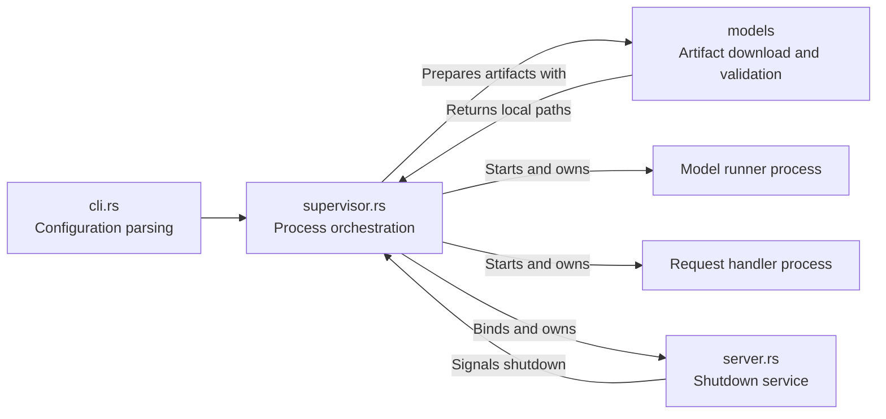
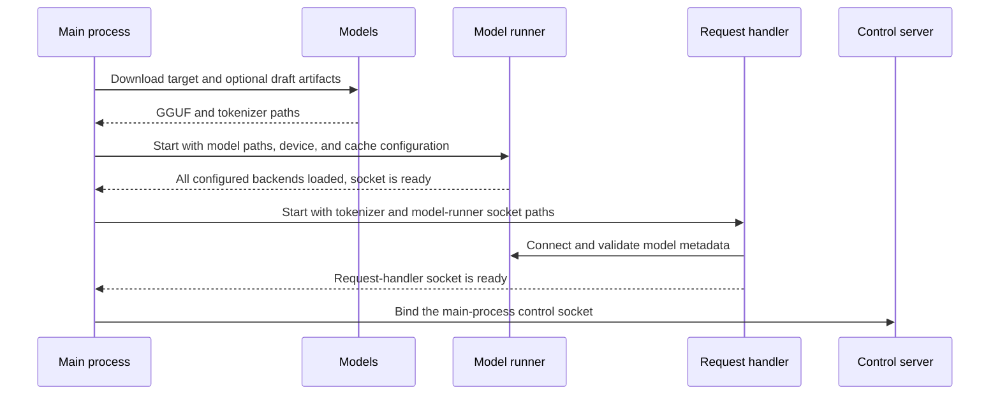
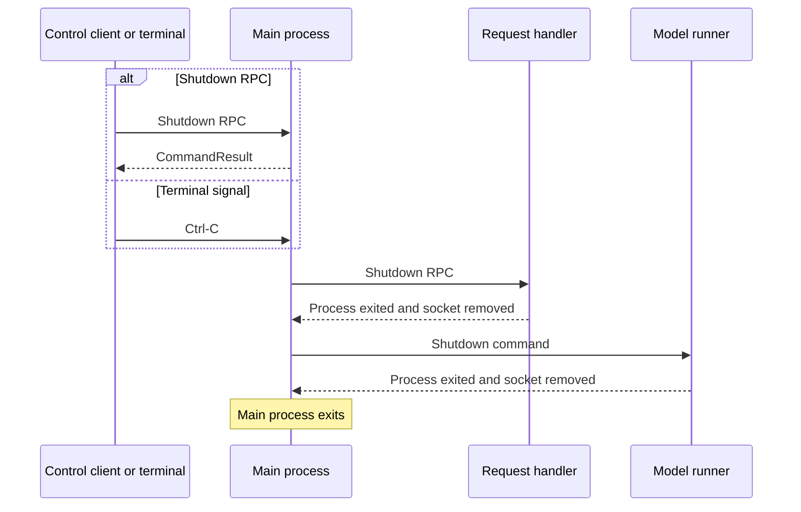

# Main process architecture

The `main_process` module implements the supervisor that prepares model
artifacts, starts the serving processes, and coordinates their shutdown.

## Component responsibilities

| Component | Responsibility |
| --- | --- |
| `cli.rs` | Parses model, device, KV-cache, scheduler, preprocessing-pool, and socket configuration, then normalizes values and supplies defaults. |
| `supervisor.rs` | Prepares artifacts, starts child processes in dependency order, waits for Ctrl-C or a control RPC, and coordinates shutdown. |
| `server.rs` | Exposes the main-process `Shutdown` RPC and owns the control socket. |
| [`models`](../models/README.md) | Validates model configuration and prepares local GGUF and tokenizer paths. |

Architecture selection and device-specific model loading happen later inside
each model-runner backend. The control server uses
`/tmp/mini-vllm-main-process.sock` by default and removes the socket when it is
dropped.

Startup follows the serving processes' dependency order:

The runner starts first because the handler connects to it during
initialization. A child's socket signals readiness; in mixed mode, the runner
binds its socket only after both CPU and GPU backends are loaded.

Shutdown uses the reverse dependency order:

The control RPC acknowledges the shutdown signal before child cleanup finishes.
Ctrl-C initiates the same cleanup directly.

If request-handler startup fails, the supervisor shuts down the already-running
model runner before returning the error. Process owners also forcibly stop
their child and remove its socket when graceful cleanup cannot complete.
