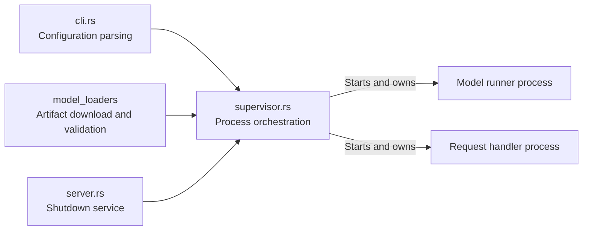
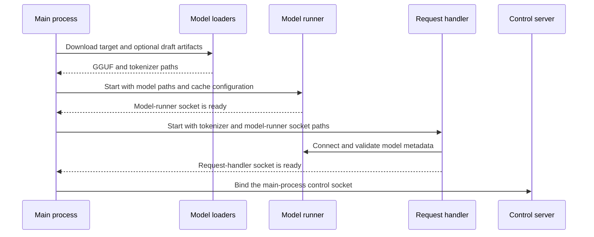
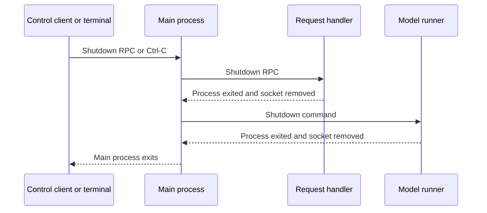

# Main process architecture

The `main_process` module implements the supervisor that prepares model
artifacts, starts the serving processes, and coordinates their shutdown.

- `cli.rs` parses model, KV-cache, and socket configuration and normalizes
  invalid or omitted values.
- `supervisor.rs` downloads the configured artifacts, starts the model runner
  and request handler in dependency order, waits for Ctrl-C or a control RPC,
  and shuts both child processes down.
- `server.rs` exposes the main process `Shutdown` RPC on
  `/tmp/mini-vllm-main-process.sock` by default. The control socket is removed
  when its server is dropped.
- Model downloading, configuration validation, architecture selection, and
  device-specific loading are described in [Model loaders](../model_loaders/README.md).

Startup follows the serving processes' dependency order:

The model runner starts first because the request handler connects to it during
initialization. Each child socket is treated as its readiness signal, so the
next stage does not start until its dependency is accepting connections.

Shutdown uses the reverse dependency order:

If request-handler startup fails, the supervisor shuts down the already-running
model runner before returning the error. Process owners also forcibly stop
their child and remove its socket when graceful cleanup cannot complete.
