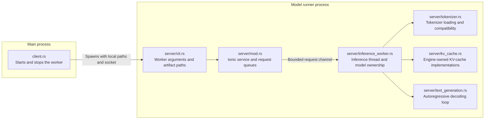
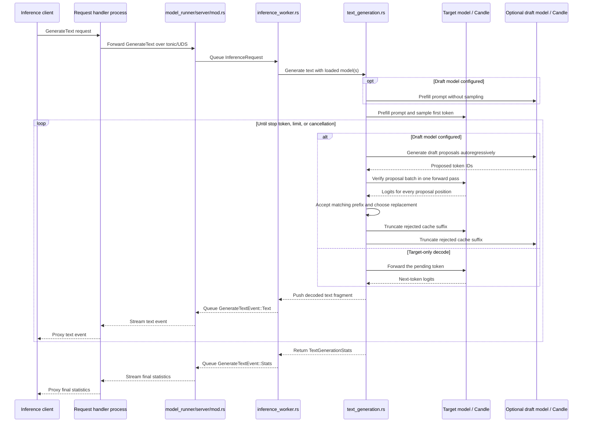

# Model runner architecture

The `model_runner` module separates the main-process lifecycle client from the
code that runs inside the model-runner process.

- `client.rs` creates the socket, starts the worker, waits for readiness, and
  sends the shutdown command.
- `server/cli.rs` receives target and optional draft GGUF paths from the main
  process.
- `server/tokenizer.rs` loads tokenizers and validates that target and draft
  vocabularies use identical token-to-ID mappings.
- `server/kv_cache.rs` preallocates separate key/value pools for contiguous or
  paged storage. Paged mode uses configurable fixed-token-count pages and
  per-layer block tables, and reconstructs contiguous tensors for the existing
  attention operations. Its physical page pool owns tensor storage and free
  page IDs, while its active block tables only map the current sequence to
  those physical pages.
- `server/inference_worker.rs` owns the target model, optional draft model,
  tokenizer, device, and corresponding KV caches on its dedicated thread. The
  target cache uses the configured byte budget; the draft cache is sized to
  hold the same number of tokens.
- `server/text_generation.rs` performs prompt prefill, ordinary greedy decode,
  or speculative decode using draft proposals, batched target verification,
  cache rollback, and request-level acceptance statistics.
- When a draft model is configured, the worker validates its tokenizer against
  the target tokenizer and then retains only the target tokenizer.
- The worker binds its socket after loading the model, so the socket signals
  readiness.
- `client.rs` manages the worker lifecycle; it does not forward inference
  requests.

Once startup is complete, inference requests come from the request-handler
process rather than through `client.rs`:

- `server/mod.rs` receives tonic requests and queues them on a bounded channel.
- `inference_worker.rs` owns the loaded model and processes requests on its
  dedicated thread, clearing its reusable caches before each request.
- `inference_worker.rs` delegates decoding to `text_generation.rs`.
- `text_generation.rs` tokenizes prompts, samples and decodes tokens, checks
  cancellation and stop tokens, and records prefill, decode, and speculative
  acceptance statistics.
- Text fragments stream immediately unless `stream_output` is false, in which
  case they are buffered.
- A successful response ends with a `TextGenerationStats` event.
