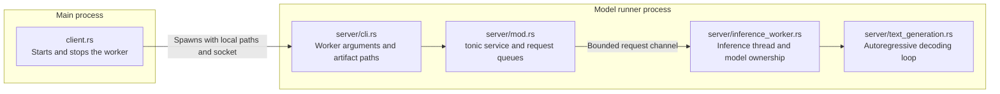
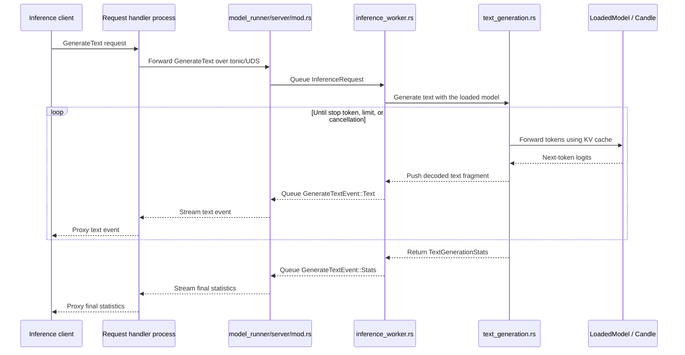

# Model runner architecture

The `model_runner` module separates the main-process lifecycle client from the
code that runs inside the model-runner process.

- `client.rs` creates the socket, starts the worker, waits for readiness, and
  sends the shutdown command.
- `server/cli.rs` parses local model paths into `ModelArtifacts`.
- `server/inference_worker.rs` owns the model, tokenizer, device, and KV-cache
  state on its dedicated thread.
- The worker binds its socket after loading the model, so the socket signals
  readiness.
- `client.rs` manages the worker lifecycle; it does not forward inference
  requests.

Once startup is complete, inference requests come from the request-handler
process rather than through `client.rs`:

- `server/mod.rs` receives tonic requests and queues them on a bounded channel.
- `inference_worker.rs` owns the loaded model and processes requests on its
  dedicated thread.
- `inference_worker.rs` delegates decoding to `text_generation.rs`.
- `text_generation.rs` tokenizes prompts, samples and decodes tokens, checks
  cancellation and stop tokens, and records timing.
- Text fragments stream immediately unless `stream_output` is false, in which
  case they are buffered.
- A successful response ends with a `TextGenerationStats` event.
