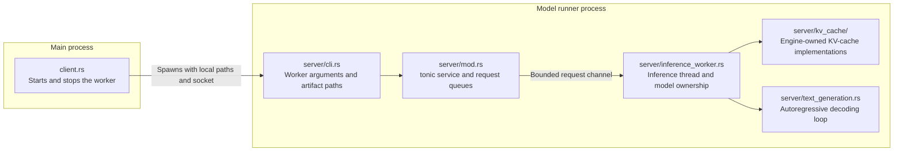
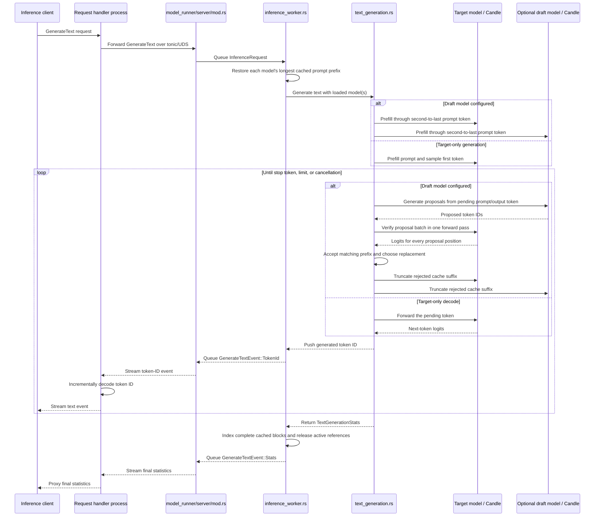

# Model runner architecture

The `model_runner` module separates the main-process lifecycle client from the
code that runs inside the model-runner process.

- `client.rs` checks that the socket path is available, starts the worker, waits
  for the worker to bind the socket, and sends the shutdown command.
- `server/cli.rs` receives target and optional draft GGUF paths from the main
  process.
- [`server/kv_cache/`](server/kv_cache/README.md) preallocates separate key/value pools for contiguous or
  paged storage. Paged mode uses configurable fixed-token-count pages and
  per-layer block tables, and reconstructs contiguous tensors for the existing
  attention operations. Its physical page pool owns tensor storage and free
  page IDs, while its active block tables only map the current sequence to
  those physical pages. Reference counts keep shared pages allocated until
  both active sequences and cached-prefix entries release them.
- Prefix-enabled paged caches create a prefix-block index. It indexes only
  complete blocks and includes the preceding block in each identity so equal
  token blocks from different prompt contexts cannot share incompatible pages.
- `server/inference_worker.rs` owns the target model, optional draft model,
  device, and corresponding KV caches on its dedicated thread. The
  target cache uses the configured byte budget; the draft cache is sized to
  hold the same number of tokens.
- `server/text_generation.rs` performs prompt prefill, ordinary greedy decode,
  or speculative decode using draft proposals, batched target verification,
  cache rollback, and request-level acceptance statistics.
- Tokenization, tokenizer compatibility checks, and incremental decoding belong
  to the request-handler process. The model runner receives and returns token
  IDs.
- The worker binds its socket after loading the model, so the socket signals
  readiness.
- `client.rs` manages the worker lifecycle; it does not forward inference
  requests.

Once startup is complete, inference requests come from the request-handler
process rather than through `client.rs`:

- `server/mod.rs` rejects inputs that cannot fit the configured KV-cache
  capacity, limits the requested output length to the remaining capacity, then
  queues valid tonic requests on a bounded channel.
- `inference_worker.rs` owns the loaded model and processes requests on its
  dedicated thread. It restores reusable prefixes before generation, indexes
  complete cached blocks after success, and releases active references after
  either success or failure.
- `inference_worker.rs` delegates decoding to `text_generation.rs`.
- `text_generation.rs` runs prefill and decode over token IDs, samples tokens,
  checks cancellation and stop tokens, and records prefill, decode, and
  speculative acceptance statistics.
- The request handler decodes generated token IDs. It streams text fragments
  immediately unless `stream_output` is false, in which case it buffers them.
- A successful response ends with a `TextGenerationStats` event.
