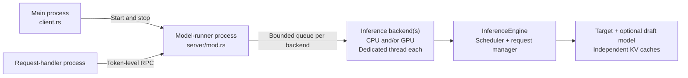
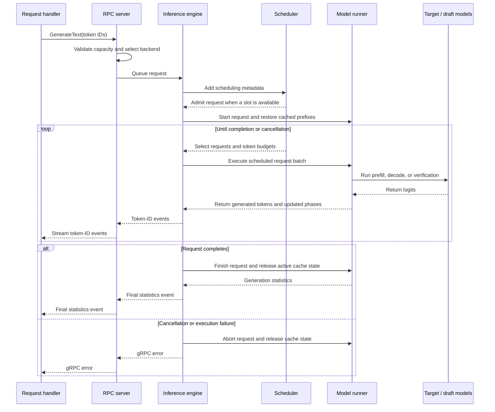

# Model runner architecture

The `model_runner` module owns model execution. Its lifecycle client runs in the
main process; the RPC server, inference backends, loaded models, schedulers, and
KV caches run in the model-runner process.

## Process and backend topology

CPU-only and GPU-only modes create one backend. Mixed mode creates both and
routes whole requests between their bounded queues in round-robin order. Each
backend has its own inference thread, scheduler, loaded models, and KV caches;
a request is never split across devices.

The server binds its Unix socket only after every configured backend has loaded
its models, making the socket a readiness signal. After startup, inference
requests arrive directly from the request-handler process rather than passing
through the lifecycle client.

## Component responsibilities

| Component | Responsibility |
| --- | --- |
| `client.rs` | Starts and stops the process, waits for readiness, and owns socket cleanup. |
| `server/cli.rs` | Receives model paths, device mode, cache settings, and scheduler settings from the main process. |
| `server/mod.rs` | Serves tonic RPCs, validates request capacity, and routes requests to inference backends. |
| `server/inference_engine.rs` | Coordinates admission, scheduled execution, event delivery, timing, and cleanup for one backend. |
| `server/request_manager.rs` | Owns request payloads, resumable execution state, response channels, and lifecycle timing. |
| `server/scheduler.rs` | Owns only scheduling metadata and applies active-request and token-budget limits. |
| `server/model_runner.rs` | Owns the target and optional draft model instances and manages their request lifecycles. |
| `server/model_instance.rs` | Pairs one loaded model with its request-aware KV-cache manager. |
| `server/text_generation.rs` | Implements resumable prefill, ordinary decoding, speculative decoding, sampling, and statistics. |
| [`server/kv_cache/`](server/kv_cache/README.md) | Implements contiguous and paged storage, prefix reuse, and per-request cache state. |

Tokenization, tokenizer compatibility checks, and incremental text decoding
belong to the request-handler process. The model runner receives token IDs and
returns token IDs followed by final generation statistics.

## Request lifecycle

The RPC server rejects empty inputs or inputs larger than the target KV-cache
capacity. If the requested output would exceed the remaining capacity, it
reduces `max_new_tokens` before queueing the request.

## Scheduling

Each backend admits requests up to its active-request limit and builds batches
within its token budget. Decode work is prioritized over prefill work; prefills
are ordered either first-come-first-served or shortest-prefill-first. Long
prefills can be split across scheduling iterations.

Paged KV caching supports multiple active requests and continuous batching. A
contiguous cache permits only one active request, so the inference engine
automatically limits its scheduler accordingly.

## Speculative decoding

When a draft model is configured, target and draft models restore cached prompt
prefixes independently and prefill through the second-to-last input token. The
draft model proposes tokens, and the target verifies proposals for scheduled
requests in a batched forward pass. The longest matching prefix is accepted;
after verification, both caches are truncated to discard state derived from
any rejected proposals.

Without a draft model, requests use ordinary target-only prefill and decode.
Both paths remain resumable between scheduling iterations and report
request-level timing; speculative responses additionally report the draft-token
acceptance rate.

## KV-cache execution

Each model instance owns a separate cache manager. The target cache uses the
configured byte budget, while the optional draft cache is sized for the same
token capacity.

Paged storage works on CPU and GPU backends. Direct paged attention is currently
CPU-only and opt-in; other execution paths reconstruct contiguous key/value
tensors from the pages before attention. Prefix-enabled paged caches retain
complete blocks for reuse across requests. See the
[KV-cache architecture](server/kv_cache/README.md) for allocation, prefix
indexing, eviction, and page ownership details.

A successful request ends with a `TextGenerationStats` event. Cancellation or
execution failure aborts the request, releases its model and cache state, and
returns a gRPC error.
