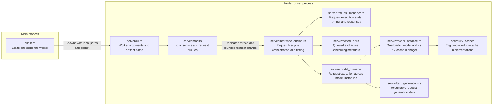
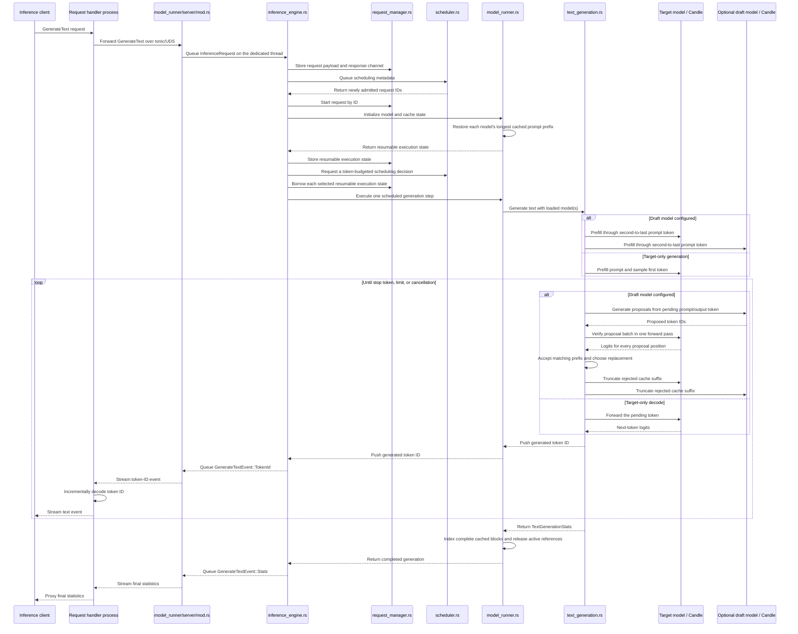

# Model runner architecture

The `model_runner` module separates the main-process lifecycle client from the
code that runs inside the model-runner process.

- `client.rs` checks that the socket path is available, starts the worker, waits
  for the worker to bind the socket, and sends the shutdown command.
- `server/cli.rs` receives target and optional draft GGUF paths and the selected
  inference device from the main process.
- [`server/kv_cache/`](server/kv_cache/README.md) preallocates separate key/value pools for contiguous or
  paged storage. Paged mode uses configurable fixed-token-count pages and
  per-layer block tables, and reconstructs contiguous tensors for the existing
  attention operations. Its physical page pool owns tensor storage and free
  page IDs, while its active block tables only map the current sequence to
  those physical pages. Page ownership states keep cached pages allocated and
  track whether active requests are currently reading them.
- Prefix-enabled paged caches create a prefix-block index. It indexes only
  complete blocks and includes the preceding block in each identity so equal
  token blocks from different prompt contexts cannot share incompatible pages.
- `server/model_runner.rs` owns the target model instance and optional draft
  model instance and exposes request start, one-step execution, completion, and
  abortion operations.
- `server/mod.rs` starts the dedicated inference thread and forwards requests
  from its bounded channel to `InferenceEngine`.
- `server/inference_engine.rs` coordinates request storage, scheduling, model
  execution, response events, and elapsed-time tracking.
- `server/request_manager.rs` owns each request's payload, resumable execution
  state, response channel, and lifecycle timing while the scheduler retains
  only the metadata needed to make decisions.
- `server/scheduler.rs` applies the selected scheduling policy and enforces the
  configured active-request and token limits without owning generation state.
- `server/model_instance.rs` keeps each loaded model paired with its cache
  manager and passes request-aware forward contexts into model execution. The
  target cache uses the configured byte budget; the draft cache is sized to
  hold the same number of tokens.
- `server/text_generation.rs` keeps each request's generation progress and
  sampling state resumable between prefill and decode iterations. It supports
  ordinary greedy decode or speculative decode using draft proposals, batched
  target verification, cache rollback, and request-level acceptance statistics.
- Tokenization, tokenizer compatibility checks, and incremental decoding belong
  to the request-handler process. The model runner receives and returns token
  IDs.
- The worker binds its socket after loading the model, so the socket signals
  readiness.
- `client.rs` manages the worker lifecycle; it does not forward inference
  requests.

Once startup is complete, inference requests come from the request-handler
process rather than through `client.rs`:

- `server/mod.rs` rejects inputs that cannot fit the configured KV-cache
  capacity, limits the requested output length to the remaining capacity, then
  queues valid tonic requests on a bounded channel.
- `inference_engine.rs` executes scheduled requests, records request-level
  timing, streams generation events, and reports updated generation state to
  the scheduler.
- `model_runner.rs` owns the models and caches, restores reusable prefixes,
  delegates decoding to `text_generation.rs`, and finishes or clears cache
  state after each request.
- `text_generation.rs` runs token-budgeted prefill chunks and decode steps,
  samples tokens, checks cancellation and stop tokens, and records prefill, decode, and
  speculative acceptance statistics.
- The request handler decodes generated token IDs. It streams text fragments
  immediately unless `stream_output` is false, in which case it buffers them.
- A successful response ends with a `TextGenerationStats` event.
