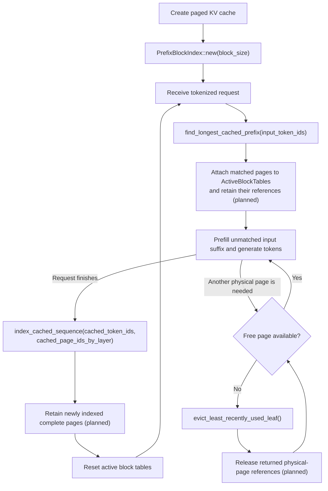

# KV-cache architecture

The model runner owns one KV-cache backend for each loaded target or draft
model. `KvCacheBackend` selects either contiguous storage or paged storage while
presenting the narrow `KvCache` interface needed by model `forward` calls.

The contiguous backend preallocates one key pool and one value pool and tracks
the cached token count for every model layer.

The paged backend separates two kinds of state:

- `PhysicalPagePool` owns the key/value tensor storage, page reference counts,
  and free physical page IDs.
- `ActiveBlockTables` maps the sequence currently being processed to physical
  pages. Resetting these tables releases the active sequence's references but
  does not release references held by the prefix index.

A physical page returns to the free list only when its final active or indexed
reference is released. Complete shared pages are immutable.

This implementation intentionally makes one prefix block equal to one physical
KV-cache page. Prefix-block size and physical-page size are separate concepts
and could differ with a more complex mapping. Keeping them equal means every
indexed block has exactly one independently retainable and evictable page per
model layer; it also avoids partial-page sharing.

## Request lifecycle



- Only complete immutable blocks are indexed; a final incomplete block is
  ignored.
- `find_longest_cached_prefix` is called for every new request before prefill.
- `index_cached_sequence` is called after the request has populated its cache
  and before its active block tables are reset.
- Tokens passed to `index_cached_sequence` must have KV values in every model
  layer. A newly sampled token that has not gone through a model forward pass
  must not be included.
- `evict_least_recently_used_leaf` removes one least-recently-used leaf per call,
  preserving the parent context of remaining blocks. A parent becomes eligible
  after its final child is removed; `Ok(None)` means the index is empty.
- Page attachment, retention, and connecting eviction to physical-page release
  are not implemented yet.

## Prefix-block index example

Consider a two-token block size and a sequence containing an original prompt
followed by generated text:

```text
Original prompt        Generated text
[1, 2] [3, 4]          [5, 6] [7]
```

Only the three complete blocks are indexed. The incomplete `[7]` block remains
active but is not reusable yet. Assume a two-layer model stored the complete
blocks in these physical pages:

| Token block | Layer 0 | Layer 1 |
| --- | --- | --- |
| `[1, 2]` | Page 10 | Page 20 |
| `[3, 4]` | Page 11 | Page 21 |
| `[5, 6]` | Page 12 | Page 22 |

### First block

The first `PrefixBlockKey` has no parent because it starts the sequence:

```text
PrefixBlockKey { parent_id: None, token_ids: [1, 2] }
```

`PrefixBlockIndex` assigns it `PrefixBlockId(0)`. Its `IndexedPrefixBlock`
stores the physical page for that logical block in every model layer:

```text
PrefixBlockId(0) -> IndexedPrefixBlock {
  page_ids_by_layer: [Page 10, Page 20]
}
```

### Second block

The next key includes the first block's ID because KV values for `[3, 4]`
depend on the tokens before it:

```text
PrefixBlockKey {
  parent_id: Some(PrefixBlockId(0)),
  token_ids: [3, 4]
}

PrefixBlockId(1) -> IndexedPrefixBlock {
  page_ids_by_layer: [Page 11, Page 21]
}
```

### Generated block

The generated block follows the same rule. The index does not distinguish
prompt tokens from generated tokens:

```text
PrefixBlockKey {
  parent_id: Some(PrefixBlockId(1)),
  token_ids: [5, 6]
}

PrefixBlockId(2) -> IndexedPrefixBlock {
  page_ids_by_layer: [Page 12, Page 22]
}
```

The resulting `blocks_map` contains:

```text
blocks_map:
  (None,    [1, 2]) -> Block 0, [Page 10, Page 20]
  (Block 0, [3, 4]) -> Block 1, [Page 11, Page 21]
  (Block 1, [5, 6]) -> Block 2, [Page 12, Page 22]
```

`PrefixBlockIndex` also keeps a set containing Block 2's key because it is the
only leaf eligible for eviction. Each block records its latest lookup or
indexing timestamp so the least recently used leaf can be selected.

Including the parent prevents an identical token block in another context,
such as `[8, 9] -> [3, 4]`, from incorrectly reusing Block 1.

### Prefix lookup

Looking up `[1, 2, 3, 4, 8, 9]` matches Blocks 0 and 1, then stops at the
divergent third block. `PrefixBlockMatch` reorganizes their page IDs by layer,
which is the layout expected by `ActiveBlockTables`:

```text
PrefixBlockMatch {
  page_ids_by_layer: [
    [Page 10, Page 11],
    [Page 20, Page 21],
  ],
}
```

Each layer contains two page IDs, so the one-block-per-page invariant tells the
caller that two prefix blocks matched. An empty outer list means no block
matched.

The model runner can later retain these physical pages, install them into the
active block tables, and run model prefill only for the unmatched suffix.
