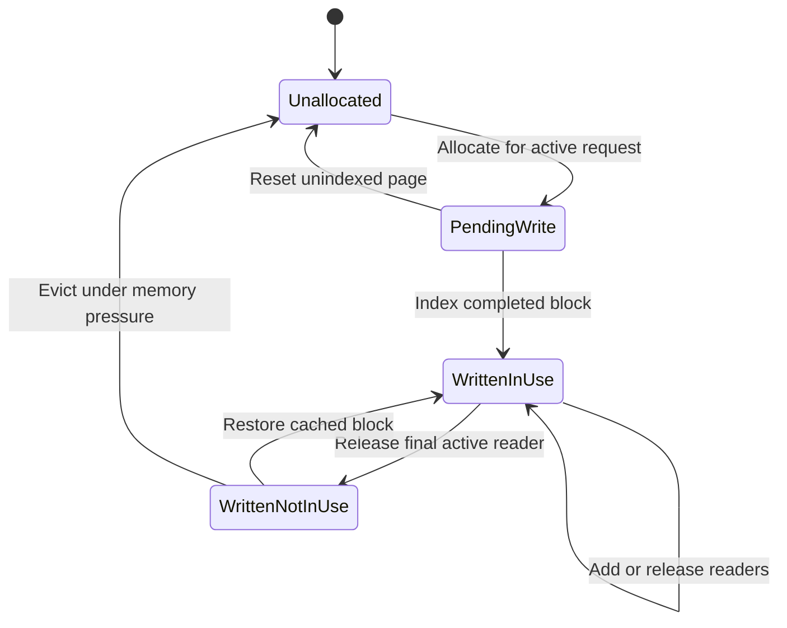
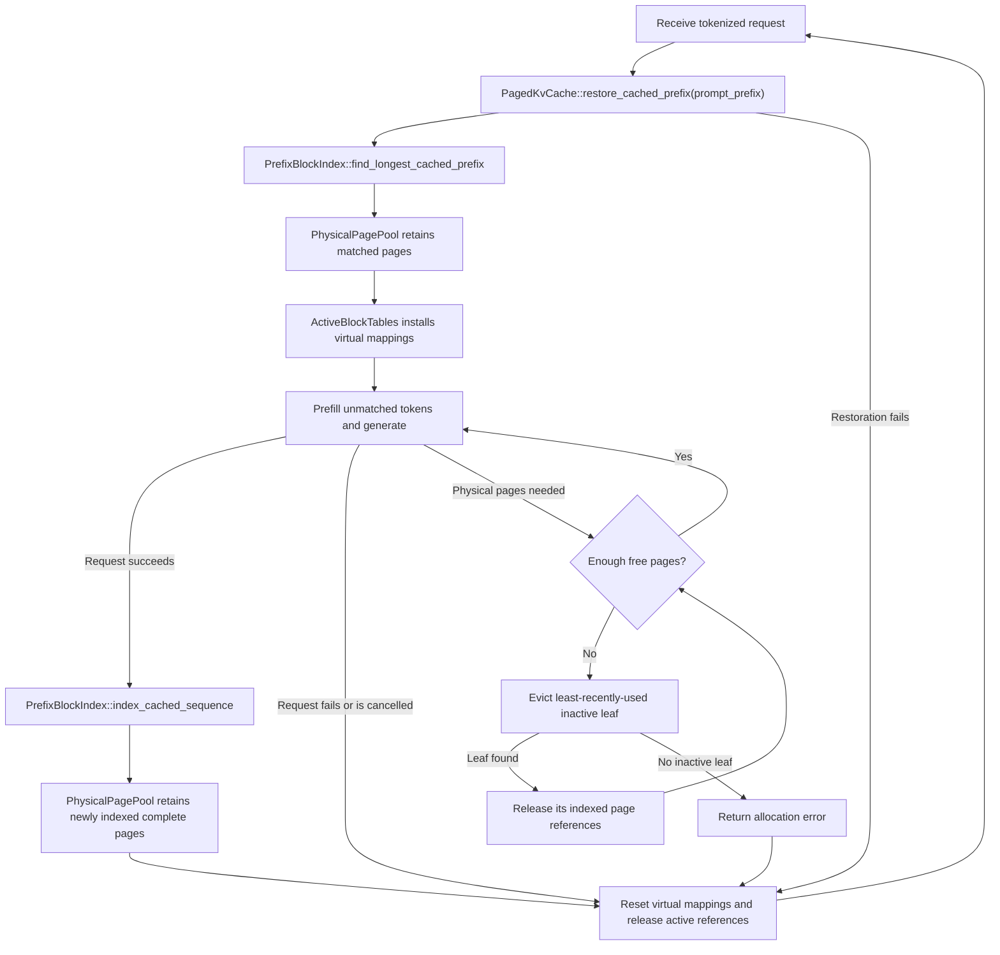

# KV-cache architecture

Each `ModelAndKvCache` owns a `KvCacheManager` for its loaded target or draft
model. The manager owns the common `KvCacheBackend`, maps request IDs to their
cache states, and binds the selected state to model `forward` calls.

`KvCacheBackend` selects either contiguous or paged storage. Paged storage can
hold multiple request states; contiguous storage currently permits one active
request.

The contiguous backend preallocates one key pool and one value pool and tracks
the cached token count for every model layer.

Paged caching separates shared cache state from the state of the request being
processed:

- `PhysicalPagePool` owns the key/value tensor storage, page ownership states,
  and free physical page IDs.
- `PrefixBlockIndex`, when enabled, maps reusable token blocks to per-layer
  physical-page bundles. It owns no tensors and changes no page states.
- `RequestPagedCacheState` owns one request's `ActiveBlockTables` and prefix
  cursor. Each `LayerBlockTable` maps that request's logical token order to
  physical page IDs; it never accesses tensors or manages page states.

`PagedKvCache` owns the shared physical pool and prefix index. Its operations
receive a `RequestPagedCacheState` and coordinate that request's virtual
mappings with the shared state.

The production files follow the same boundary:

- `physical_page_pool.rs` implements tensor storage, allocation, ownership
  counting, and physical page reads and writes.
- `manager.rs` maps request IDs to cache states and binds them to the shared
  backend for model execution.
- `active_block_tables.rs` implements the current sequence's virtual block
  tables without accessing tensors.
- `prefix_index.rs` implements reusable-prefix lookup and LRU leaf selection.
- `paged_cache.rs` orchestrates the other components and presents the paged
  cache backend to model execution.



Only `PendingWrite` is mutable. `WrittenNotInUse` cannot be overwritten until
memory pressure evicts it, returns its ID to the free list, and a later
allocation makes it `PendingWrite`. A later request for the evicted prefix must
recompute its KV values.

This implementation intentionally makes one prefix block equal to one physical
KV-cache page. Prefix-block size and physical-page size are separate concepts
and could differ with a more complex mapping. Keeping them equal means every
indexed block has exactly one independently retainable and evictable page per
model layer; it also avoids partial-page sharing.

## Request lifecycle



- Only complete blocks whose KV values exist in every model layer are indexed.
- Target and draft caches restore prefixes independently. The final prompt token
  remains pending so it can produce the first generation logits.
- Eviction removes only inactive prefixes; the active request's prefix remains
  protected.

## Prefix-block index example

Consider a two-token block size and a sequence containing an original prompt
followed by generated text:

```text
Original prompt        Generated text
[1, 2] [3, 4]          [5, 6] [7]
```

Only the three complete blocks are indexed. The incomplete `[7]` block is not
reusable and is released when the active block tables are reset. Assume a
two-layer model stored the complete blocks in these physical pages:

| Token block | Layer 0 | Layer 1 |
| --- | --- | --- |
| `[1, 2]` | Page 10 | Page 20 |
| `[3, 4]` | Page 11 | Page 21 |
| `[5, 6]` | Page 12 | Page 22 |

### First block

The first `PrefixBlockKey` has no parent because it starts the sequence:

```text
PrefixBlockKey { parent_id: None, token_ids: [1, 2] }
```

`PrefixBlockIndex` assigns it `PrefixBlockId(0)`. Its `IndexedPrefixBlock`
stores the physical page for that logical block in every model layer:

```text
PrefixBlockId(0) -> IndexedPrefixBlock {
  page_ids_by_layer: [Page 10, Page 20]
}
```

### Second block

The next key includes the first block's ID because KV values for `[3, 4]`
depend on the tokens before it:

```text
PrefixBlockKey {
  parent_id: Some(PrefixBlockId(0)),
  token_ids: [3, 4]
}

PrefixBlockId(1) -> IndexedPrefixBlock {
  page_ids_by_layer: [Page 11, Page 21]
}
```

### Generated block

The generated block follows the same rule. The index does not distinguish
prompt tokens from generated tokens:

```text
PrefixBlockKey {
  parent_id: Some(PrefixBlockId(1)),
  token_ids: [5, 6]
}

PrefixBlockId(2) -> IndexedPrefixBlock {
  page_ids_by_layer: [Page 12, Page 22]
}
```

The resulting `blocks_map` contains:

```text
blocks_map:
  (None,    [1, 2]) -> Block 0, [Page 10, Page 20]
  (Block 0, [3, 4]) -> Block 1, [Page 11, Page 21]
  (Block 1, [5, 6]) -> Block 2, [Page 12, Page 22]
```

`PrefixBlockIndex` also keeps a set containing Block 2's key because it is the
only leaf eligible for eviction. Each block records its latest lookup or
indexing timestamp so the least recently used leaf can be selected.

Including the parent prevents an identical token block in another context,
such as `[8, 9] -> [3, 4]`, from incorrectly reusing Block 1.

### Prefix lookup

Looking up `[1, 2, 3, 4, 8, 9]` matches Blocks 0 and 1, then stops at the
divergent third block. `PrefixBlockMatch` reorganizes their page IDs by layer,
which is the layout expected by `ActiveBlockTables`:

```text
PrefixBlockMatch {
  page_ids_by_layer: [
    [Page 10, Page 11],
    [Page 20, Page 21],
  ],
  cursor: Block 1 after 4 matched tokens,
}
```

The cursor records the final matched block and the four-token prefill start
position. `PagedKvCache::restore_cached_prefix` retains these physical pages,
installs them into the active block tables, saves the cursor for completion
indexing, and returns the token count so request processing prefills only the
unmatched suffix. A match at the root has no pages and a zero-token cursor.
