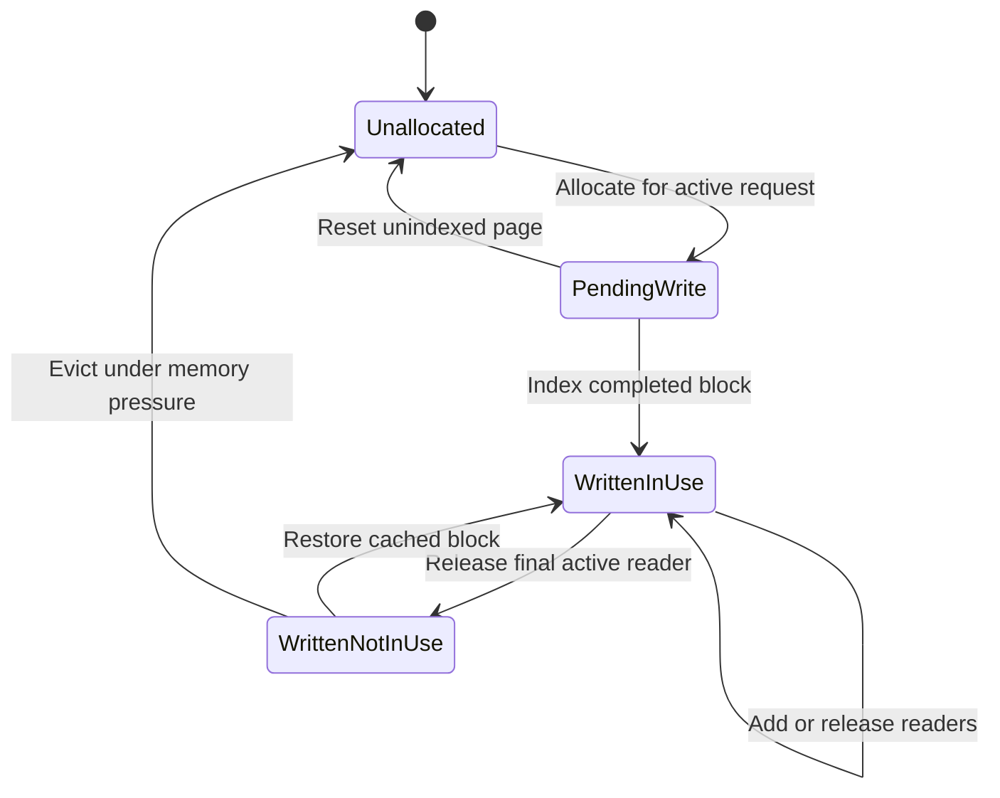
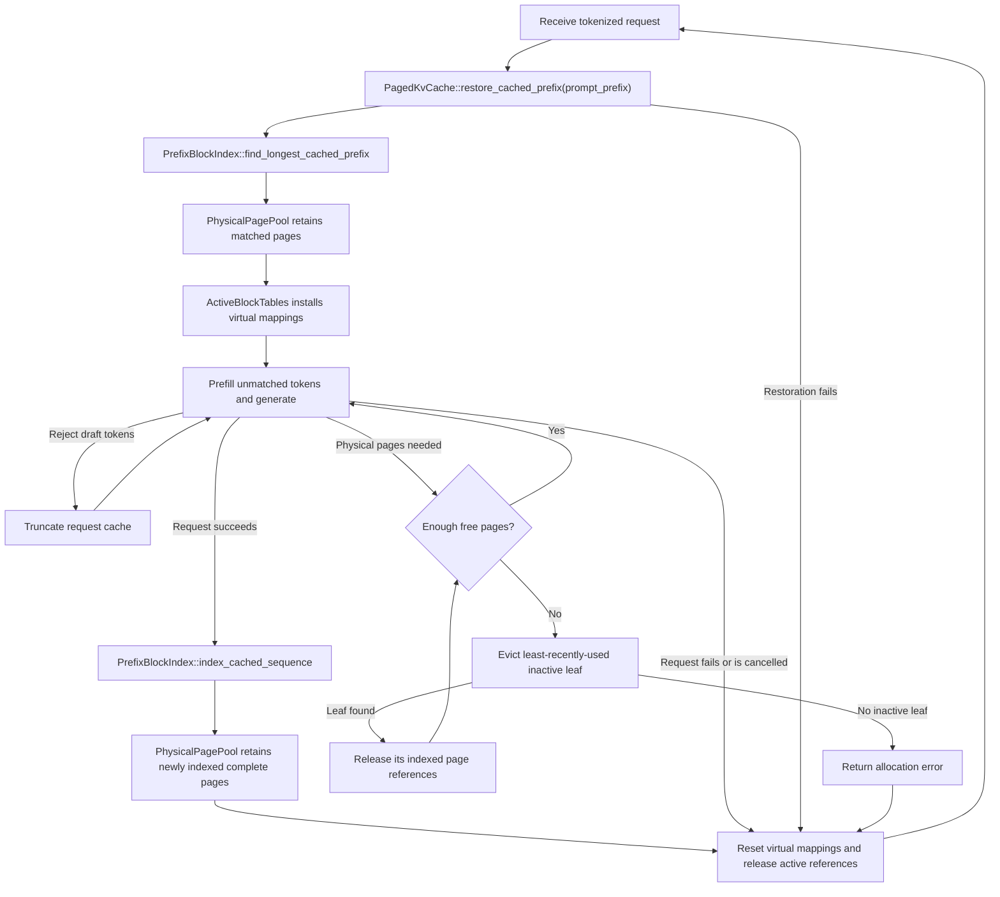
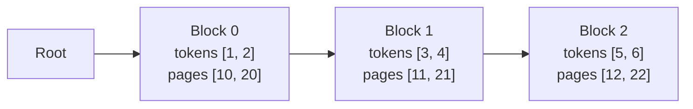

# KV-cache architecture

Each `ModelInstance` owns a `KvCacheManager` for its loaded target or draft
model. The manager owns the common `KvCacheBackend`, maps request IDs to their
cache states, and directly provides request-aware cache access during model
forward calls.

## Cache backends

`KvCacheBackend` selects contiguous or paged storage. Both keep mutable sequence
progress in request-specific state.

### Contiguous cache

The contiguous backend has one preallocated key/value storage region and
permits only one active request. `RequestContiguousCacheState` tracks that
request's cached token count for every model layer, while `ContiguousKvCache`
owns the shared tensor storage and its capacity.

### Paged cache

The paged backend maps multiple request states to different physical pages and
is intended for continuous batching.

The `paged` CLI mode enables page-backed storage, while `paged-prefix` also
retains completed blocks for reuse by later requests. Page-backed storage works
on CPU and GPU backends. Attention can consume the page layout directly only on
CPU for now, when `MINI_VLLM_ENABLE_CPU_PAGED_ATTENTION` is enabled; other paths
materialize contiguous key/value tensors from the pages before attention.

Paged caching separates shared state from each active request:

| Component | Responsibility |
| --- | --- |
| `PhysicalPagePool` | Owns key/value tensor storage, page ownership states, and free physical page IDs. |
| `PrefixBlockIndex` | When enabled, maps reusable token blocks to per-layer page bundles without owning tensors or changing page states. |
| `RequestPagedCacheState` | Owns one request's active block tables and prefix cursor. |
| `LayerBlockTable` | Maps one request layer's logical token order to physical page IDs without accessing tensors or managing page states. |

`PagedKvCache` owns the shared physical pool and prefix index. Concurrent
requests have independent `RequestPagedCacheState` values, and cache operations
coordinate each request's virtual mappings with the shared state.

## Source layout

The production files follow the same boundary:

| File | Responsibility |
| --- | --- |
| `manager.rs` | Maps request IDs to cache states and implements the model-facing cache interface. |
| `contiguous_cache.rs` | Separates contiguous tensor storage from per-request, per-layer progress. |
| `paged_cache.rs` | Coordinates shared paged storage, prefix metadata, and request mappings. |
| `physical_page_pool.rs` | Implements tensor storage, allocation, ownership counting, and page reads and writes. |
| `active_block_tables.rs` | Implements per-request virtual block tables without accessing tensors. |
| `prefix_index.rs` | Implements reusable-prefix lookup and LRU leaf selection. |

## Physical-page lifecycle



Only `PendingWrite` is mutable. `WrittenNotInUse` cannot be overwritten until
memory pressure evicts it, returns its ID to the free list, and a later
allocation makes it `PendingWrite`. A later request for the evicted prefix must
recompute its KV values.

This implementation intentionally makes one prefix block equal to one physical
KV-cache page. Prefix-block size and physical-page size are separate concepts
and could differ with a more complex mapping. Keeping them equal means every
indexed block has exactly one independently retainable and evictable page per
model layer; it also avoids partial-page sharing.

## Prefix-enabled paged-cache lifecycle



- Only complete blocks whose KV values exist in every model layer are indexed.
- Target and draft caches restore prefixes independently. The final prompt token
  remains pending so it can produce the first generation logits.
- Each concurrently scheduled request has its own block tables and cached-token
  counts. Truncation after rejected draft tokens releases pages that are no
  longer part of that request.
- Eviction excludes the allocating request's active prefix cursor. Page
  reference counts prevent storage used by any other active request from being
  overwritten, even if its prefix-index leaf is evicted.

## Prefix-block index example

Consider a two-token block size and a sequence containing an original prompt
followed by generated text:

```text
Original prompt        Generated text
[1, 2] [3, 4]          [5, 6] [7]
```

Only the three complete blocks are indexed. The incomplete `[7]` block is not
reusable and is released when the active block tables are reset. Assume a
two-layer model stored the complete blocks in these physical pages:

| Token block | Layer 0 | Layer 1 |
| --- | --- | --- |
| `[1, 2]` | Page 10 | Page 20 |
| `[3, 4]` | Page 11 | Page 21 |
| `[5, 6]` | Page 12 | Page 22 |



Each key combines its token block with its parent block ID. This prevents an
identical block in another context, such as `[8, 9] -> [3, 4]`, from reusing
Block 1. Prompt and generated blocks follow the same rule. Each block records
its latest access time; Block 2 is initially the only leaf eligible for LRU
eviction.

Looking up `[1, 2, 3, 4, 8, 9]` matches Blocks 0 and 1. The resulting
`PrefixBlockMatch` contains pages `[[10, 11], [20, 21]]`, grouped by layer, and
a cursor at Block 1 after four tokens. Restoration retains those pages, installs
them in the active block tables, and returns `4` so prefill begins at the
unmatched suffix. A root match contains no pages and returns `0`.
