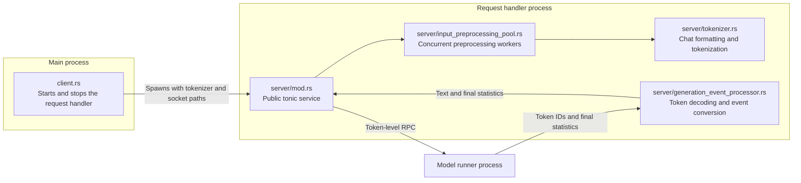
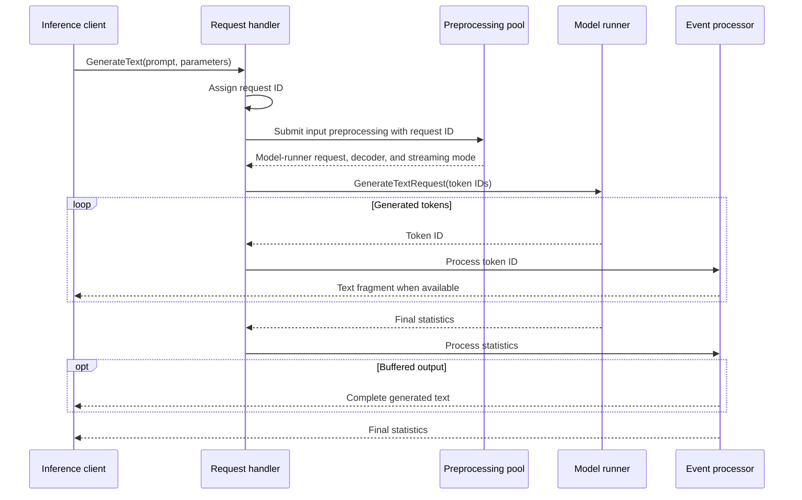

# Request handler architecture

The `request_handler` module separates the main-process lifecycle client from
the code that runs inside the request-handler process.

## Component responsibilities

| Component | Responsibility |
| --- | --- |
| `client.rs` | Starts and stops the process, waits for readiness, and owns socket cleanup. |
| `server/mod.rs` | Connects to the model runner, fetches metadata, validates startup compatibility, serves public RPCs, and assigns request IDs. |
| `server/input_preprocessing_pool.rs` | Runs request validation, chat formatting, and tokenization on a fixed-size OS-thread pool outside the async runtime. |
| `server/tokenizer.rs` | Loads and validates tokenizers, formats prompts, creates model-runner requests, and incrementally decodes generated token IDs. |
| `server/generation_event_processor.rs` | Converts token events to streamed text fragments or one buffered response, followed by final statistics. |

The public socket is bound only after upstream compatibility checks succeed,
making it the readiness signal. Preprocessing runs on a fixed-size OS-thread
pool, while per-request forwarding uses bounded asynchronous queues to apply
backpressure.

The generation path is:

A successful response always ends with a statistics event. Transport errors,
malformed model-runner events, incremental decoding failures, and a
model-runner stream that closes before its final statistics are forwarded to
the inference client as gRPC errors.

During shutdown, the shutdown RPC stops the tonic server. Dropping the
preprocessing pool then signals and joins all of its worker threads.
