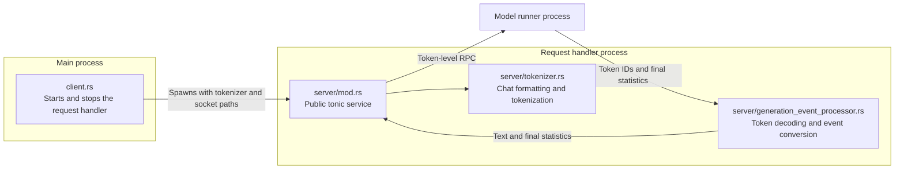
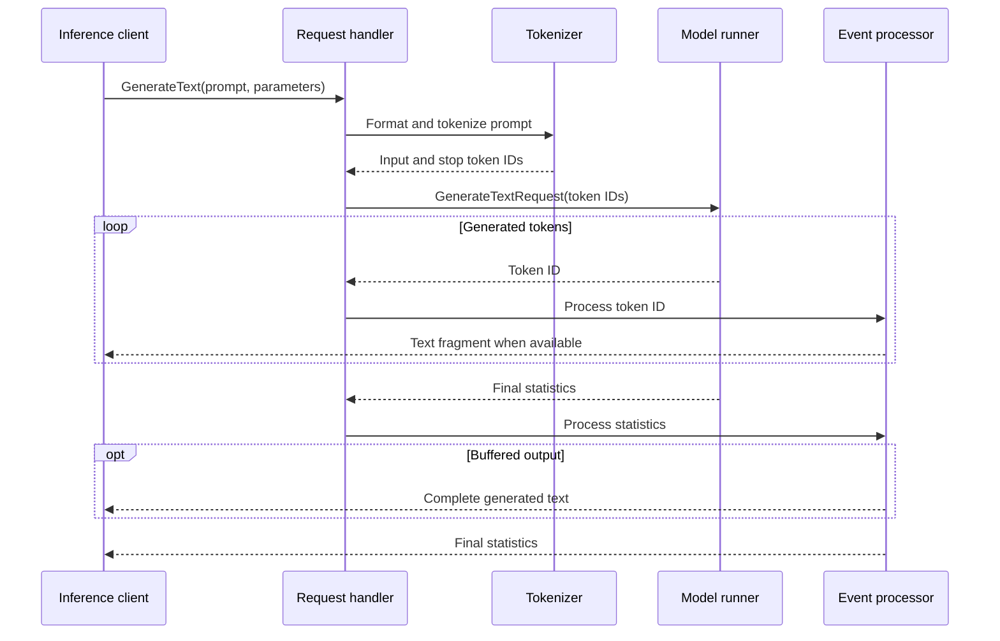

# Request handler architecture

The `request_handler` module separates the main-process lifecycle client from
the code that runs inside the request-handler process.

- `client.rs` starts the request-handler process, waits for its socket, exposes
  the public generation client, and manages shutdown and socket cleanup.
- `server/mod.rs` connects to the model runner before binding its public socket,
  so the socket indicates that the request handler is ready to serve requests.
- `server/tokenizer.rs` loads the target tokenizer, validates the optional draft
  tokenizer and both models' vocabulary sizes, formats chat prompts, tokenizes
  model input, and incrementally decodes generated token IDs.
- `server/generation_event_processor.rs` converts model-runner token events into
  public text events. It emits fragments immediately for streaming requests or
  buffers them into one response when streaming is disabled.
- The request handler owns text-oriented preprocessing and postprocessing; the
  model runner receives token IDs and returns token IDs plus final generation
  statistics.

The generation path is:

A successful response always ends with a statistics event. Transport errors,
malformed model-runner events, and incremental decoding failures are forwarded
to the inference client as gRPC errors.
